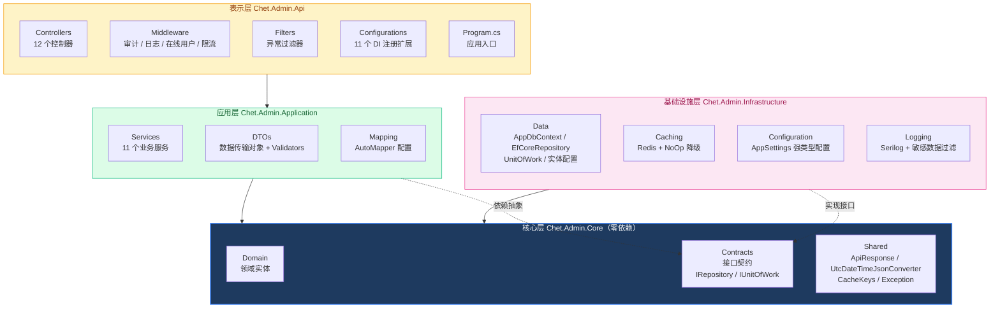

# Chet.Admin 来了！一套 .NET 10 + Vue3 的企业级权限系统 🚀

> 《Chet.Admin 全栈实战》系列第 1 篇

---

## 前言

搭建中后台系统，你是不是也遇到过这些痛点？

- ❌ 从零搭脚手架，权限、认证、审计全要自己写
- ❌ 找的开源项目要么太重，要么功能不全
- ❌ 前后端割裂，联调踩坑无数
- ❌ 文档跟不上代码，看懂了也跑不起来

**Chet.Admin** 就是为解决这些问题而来的。

---

## 这是什么

**Chet.Admin** 是一套采用前后端分离架构的企业级 RBAC（基于角色的访问控制）权限管理系统，开箱即用。

- **后端**：.NET 10 + Clean Architecture + DDD
- **前端**：Vue 3 + Vben Admin 5.7 + Ant Design Vue
- **数据库**：SQLite（开发期）/ MySQL / PostgreSQL（生产）

整套系统覆盖了 **13 个核心功能模块**，从认证登录到文件上传，从权限管理到在线用户追踪，全部内置实现。

---

## 技术栈一览

### 后端

| 技术 | 用途 |
| ---- | ---- |
| .NET 10 + C# 12 | 框架基础 |
| EF Core | ORM（SQLite / MySQL / PostgreSQL） |
| JWT | 双令牌认证 |
| Serilog | 结构化日志 |
| FluentValidation | 参数校验 |
| AutoMapper | 对象映射 |
| Redis | 缓存（支持 NoOp 降级） |
| BCrypt | 密码哈希 |
| Swagger / OpenAPI | API 文档 |

### 前端

| 技术 | 用途 |
| ---- | ---- |
| Vue 3 + TypeScript | 框架 |
| Vite 7 | 构建工具 |
| Ant Design Vue 4 | UI 组件库 |
| Pinia | 状态管理 |
| Vue Router | 动态路由权限 |
| Tailwind CSS v4 | 原子化 CSS |
| VxeTable | 表格组件 |
| pnpm + Turbo | Monorepo |

---

## 功能预览

> 📌 以下为系统界面截图：

### 登录页


### 仪表盘


### 用户管理


### 角色管理


### 菜单管理


### 部门管理


### 字典管理


### 操作日志


### 通知公告


---

## 架构设计

### 后端：Clean Architecture + DDD

后端采用 **Clean Architecture（整洁架构）** 设计，遵循 **DDD 领域驱动设计** 思想，分为四层，依赖方向**始终向内指向 Core 层**。

<!-- 后端分层架构图（Mermaid） -->


> **核心原则**：依赖方向始终向内指向 Core 层，Core 层不依赖任何其他层。

```
Chet.Admin.Api/
├── Chet.Admin.Api/                # 表示层：控制器、中间件、启动配置
│   ├── Controllers/               # 12 个控制器（Auth/User/Role/Menu...）
│   ├── Middleware/                # 4 个中间件（审计/日志上下文/在线用户/限流）
│   ├── Filters/                   # 异常过滤器
│   ├── Configurations/           # 11 个配置类（DI 注册扩展）
│   └── Program.cs                 # 应用入口
│
├── Chet.Admin.Application/        # 应用层：业务逻辑
│   ├── Chet.Admin.Services/       # 11 个业务服务实现
│   │   ├── Auth/                  # 认证服务、验证码服务
│   │   ├── Jwt/                   # JWT 令牌服务
│   │   ├── User/                  # 用户服务、在线用户服务
│   │   ├── Role/                  # 角色服务、数据权限服务
│   │   ├── Menu/                  # 菜单服务
│   │   ├── Department/            # 部门服务
│   │   ├── Dictionary/            # 字典服务
│   │   ├── Audit/                 # 审计日志服务
│   │   ├── Notification/          # 通知服务
│   │   ├── File/                  # 文件服务
│   │   ├── Dashboard/             # 仪表盘服务
│   │   └── Security/              # 密码服务
│   ├── Chet.Admin.DTOs/           # 数据传输对象 + Validators 校验
│   └── Chet.Admin.Mapping/        # AutoMapper 映射配置
│
├── Chet.Admin.Core/               # 核心层（不依赖任何其他层）
│   ├── Chet.Admin.Domain/         # 领域实体（User/Role/Menu/Department...）
│   ├── Chet.Admin.Contracts/      # 接口契约（服务接口 + 仓储接口）
│   │   ├── IRepository.cs          # 泛型仓储接口
│   │   └── IUnitOfWork.cs          # 工作单元接口
│   └── Chet.Admin.Shared/         # 共享类
│       ├── Api/                    # ApiResponse 统一响应 + UtcDateTimeJsonConverter
│       ├── Caching/                # 缓存键定义
│       └── Exception/              # 业务异常（BadRequest/NotFound）
│
└── Chet.Admin.Infrastructure/     # 基础设施层
    ├── Chet.Admin.Data/           # EF Core 数据访问
    │   ├── AppDbContext.cs          # 数据库上下文
    │   ├── EfCoreRepository.cs     # 泛型仓储实现
    │   ├── UnitOfWork.cs            # 工作单元实现
    │   └── {Entity}/               # 各实体配置 + 仓储实现
    ├── Chet.Admin.Caching/         # Redis 缓存 + NoOp 降级
    ├── Chet.Admin.Configuration/   # 强类型配置（AppSettings）
    └── Chet.Admin.Logging/         # Serilog 配置 + 敏感数据过滤
```

**核心原则**：

- **Core 层零依赖**：Domain / Contracts / Shared 不依赖任何其他层
- **依赖反转**：上层依赖 Core 的抽象，Infrastructure 实现 Core 的接口
- **DI 约定**：Services 注册为 Scoped，Repository 注册为 Scoped，配置注册为 Singleton

### 前端：Vben Admin Monorepo

前端基于 [Vben Admin v5.7](https://vben.pro) 框架，采用 **pnpm Monorepo** 架构。

<!-- 前端 Monorepo 结构图 -->


### 中间件管道

后端通过中间件管道处理请求，顺序精心设计：

```csharp
app.ConfigureExceptionHandling();          // 异常处理
app.UseLogContext();                        // 日志上下文
app.UseCors("DefaultPolicy");              // 跨域
app.UseRateLimiting();                      // 限流
app.ConfigureSwaggerUI();                   // Swagger
app.ConfigureAuthMiddleware(appSettings);   // JWT 认证
app.UseMiddleware<AuditLogMiddleware>();     // 操作审计
app.UseMiddleware<OnlineUserTrackingMiddleware>(); // 在线用户追踪
app.UseStaticFiles(...);                    // 静态文件（uploads）
app.MapControllers();                       // 路由映射
```

---

## 安全特性

安全是权限系统的生命线，Chet.Admin 内置了完整的安全机制：

- ✅ **JWT 双令牌**（Access Token + Refresh Token）
- ✅ **Token Rotation** 每次刷新更换 Refresh Token，防重放
- ✅ **BCrypt 密码哈希** 不可逆加密
- ✅ **登录锁定** 失败 5 次锁定 15 分钟
- ✅ **密码过期策略** 90 天强制修改
- ✅ **限流防护** 防暴力破解（可配置 IP / 接口维度）
- ✅ **操作审计日志** 中间件自动记录所有写操作
- ✅ **在线用户追踪** + 强制下线
- ✅ **验证码** 登录验证码保护

---

## 快速启动

3 条命令就能跑起来：

```bash
# 后端
cd Chet.Admin.Api
dotnet run --project Chet.Admin.Api

# 前端
cd Chet.Admin.Web
pnpm install
pnpm dev:antd
```

打开 http://localhost:5666，用默认账号 `admin@example.com / Admin@123` 登录即可。

> 完整启动教程见下一篇 👀

---

## 开源地址

- **GitHub**：https://github.com/qiect/Chet.Admin
- **Gitee**：https://gitee.com/qiect/Chet.Admin

觉得有帮助的话，**点个 Star ⭐** 支持一下吧！你的 Star 是我持续更新的动力～

---

## 系列预告

本系列共 **20 篇**，会逐一拆解每个模块的设计与实现：

| 篇目 | 主题 |
| ---- | ---- |
| 01 | 开篇总览（本篇） |
| 02 | 快速上手 |
| 03 | 项目结构 |
| 04 | 后端分层架构 |
| 05 | JWT 认证与安全 |
| 06 | RBAC 权限模型 |
| 07-17 | 13 个功能模块逐一详解 |
| 18 | 时间时区统一方案 |
| 19 | 项目重命名指南 |
| 20 | 部署上线 |

**下篇预告**：「Chet.Admin 5 分钟启动！前后端联调保姆教程 ⚡」

---

## 互动

你目前在用什么权限系统？自研还是开源？评论区聊聊～

---

> 🔗 GitHub：https://github.com/qiect/Chet.Admin
> 🔗 Gitee：https://gitee.com/qiect/Chet.Admin
> ⭐ 觉得不错的话，点个 Star 支持一下吧！

`#ChetAdmin` `#全栈开发` `#.NET10` `#Vue3` `#开源项目` `#RBAC`
