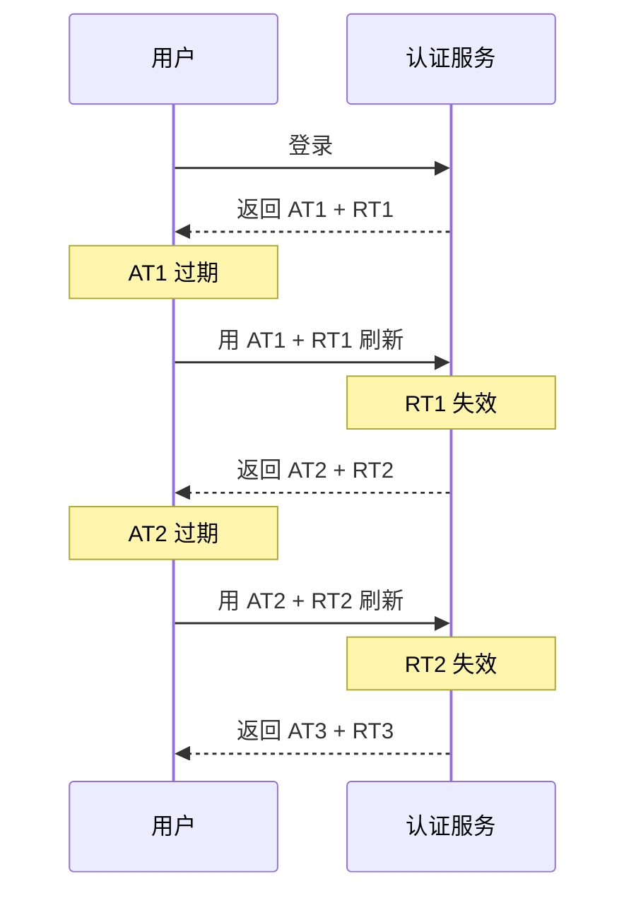
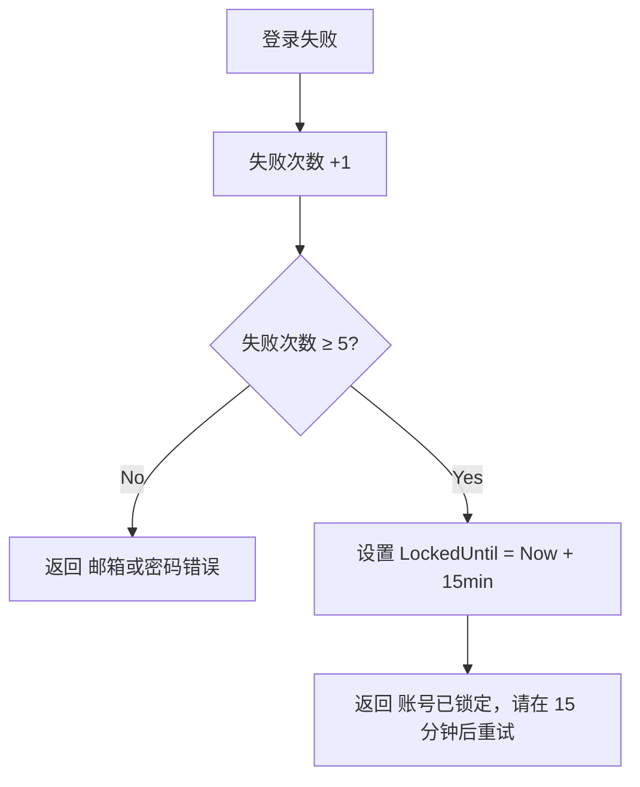
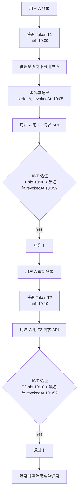
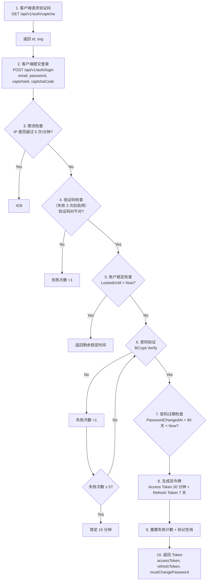
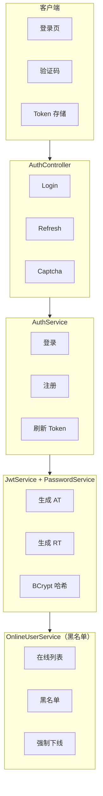

# Chet.Admin 安全基石：JWT 双令牌 + 刷新 + 登录锁定 🔐

> 《Chet.Admin 全栈实战》系列第 5 篇

---

## 前言

权限系统的**第一要务是安全**。Chet.Admin 内置了 8 道安全防线：

- ✅ JWT 双令牌（Access + Refresh）
- ✅ Token Rotation（每次刷新换新 Refresh Token）
- ✅ BCrypt 密码哈希（不可逆）
- ✅ 登录失败锁定（5 次失败锁 15 分钟）
- ✅ 密码过期策略（90 天强制改）
- ✅ 强制下线黑名单（notBefore claim 比对）
- ✅ 限流防护（防暴力破解）
- ✅ 图形验证码

这篇把每道防线**从源码到原理**彻底讲透：

- ✅ 双令牌设计思路
- ✅ Token Rotation 防重放
- ✅ BCrypt 哈希原理
- ✅ 登录锁定机制
- ✅ 强制下线实现
- ✅ 验证码流程

---

## 一、JWT 双令牌设计

### 为什么需要两个 Token？

| Token | 用途 | 有效期 | 存储 |
| ---- | ---- | ---- | ---- |
| **Access Token** | 调用 API | 30 分钟 | 内存 / localStorage |
| **Refresh Token** | 刷新 Access Token | 7 天 | localStorage / HttpOnly Cookie |

**单独用 Access Token 的问题**：

- 有效期短（30 分钟）→ 用户频繁被踢下线
- 有效期长 → 被盗后风险大

**双令牌方案**：

- Access Token 短命（30 分钟）→ 即使被盗，损失有限
- Refresh Token 长命（7 天）→ 用户无感续期
- Refresh Token 一次一换 → 被盗也只能用一次

### 配置

`appsettings.json`：

```json
"Jwt": {
  "Enabled": true,
  "SecretKey": "YourSecretKeyForJWTAuthentication1234567890",
  "Issuer": "Chet.Admin",
  "Audience": "Chet.Admin",
  "AccessTokenExpirationInMinutes": 30,
  "RefreshTokenExpirationDays": 7
}
```

| 配置项 | 说明 | 默认值 |
| ---- | ---- | ---- |
| Enabled | 启用 JWT | true |
| SecretKey | HMAC-SHA256 签名密钥（≥32 字节） | 开发密钥 |
| AccessTokenExpirationInMinutes | Access Token 有效期 | 30 分钟 |
| RefreshTokenExpirationDays | Refresh Token 有效期 | 7 天 |

> 🚨 **生产环境必须改 SecretKey！** GitHub 上这个密钥是公开的。

---

## 二、Access Token 生成

`JwtService.GenerateAccessTokenAsync()`：

```csharp
public async Task<string> GenerateAccessTokenAsync(UserEntity user)
{
    _logger.LogInformation("Generating access token for user: {Email}", user.Email);

    // 1. 定义 JWT 声明（Claims）
    var claims = new List<Claim>
    {
        new Claim(JwtRegisteredClaimNames.Sub, user.Id.ToString()),  // 用户 ID
        new Claim(JwtRegisteredClaimNames.Email, user.Email),       // 邮箱
        new Claim(JwtRegisteredClaimNames.Jti, Guid.NewGuid().ToString()), // 唯一标识
        new Claim(ClaimTypes.Name, user.Name),                      // 用户名（审计用）
    };

    // 2. 添加角色 Claims
    var roles = await _roleRepository.GetRolesByUserIdAsync(user.Id);
    foreach (var role in roles)
    {
        claims.Add(new Claim(ClaimTypes.Role, role.Code));  // 角色码
    }

    // 3. 添加权限 Claims（按钮级权限）
    var permissions = await _menuRepository.GetPermissionCodesByUserIdAsync(user.Id);
    foreach (var permission in permissions)
    {
        claims.Add(new Claim("permission", permission));
    }

    // 4. 签名
    var jwtSettings = _appSettings.Jwt ?? new JwtSettings();
    var key = new SymmetricSecurityKey(Encoding.UTF8.GetBytes(jwtSettings.SecretKey));
    var creds = new SigningCredentials(key, SecurityAlgorithms.HmacSha256);

    // 5. 创建 Token
    var token = new JwtSecurityToken(
        issuer: jwtSettings.Issuer,
        audience: jwtSettings.Audience,
        claims: claims,
        notBefore: DateTime.UtcNow,  // ⭐ 生效时间（强制下线用）
        expires: DateTime.UtcNow.AddMinutes(jwtSettings.AccessTokenExpirationMinutes),
        signingCredentials: creds);

    return new JwtSecurityTokenHandler().WriteToken(token);
}
```

### Token 里有什么？

解码后的 JWT Payload：

```json
{
  "sub": "1",
  "email": "admin@example.com",
  "jti": "a1b2c3d4-...",
  "unique_name": "超级管理员",
  "role": ["admin"],
  "permission": [
    "dashboard:view",
    "system:user:list",
    "system:user:create",
    "system:role:list"
  ],
  "nbf": 1783680000,
  "exp": 1783681800,
  "iat": 1783680000,
  "iss": "Chet.Admin",
  "aud": "Chet.Admin"
}
```

**亮点**：

- ✅ **角色** + **权限** 都在 Token 里，前端无需二次请求
- ✅ **`nbf`（Not Before）** 字段用于强制下线（见后文）
- ✅ **`jti`** 唯一标识，防重放

---

## 三、Refresh Token 生成

```csharp
public string GenerateRefreshToken()
{
    _logger.LogInformation("Generating refresh token");

    // 使用密码学安全的随机数生成器（CSPRNG）
    var randomNumber = new byte[32];
    using (var rng = RandomNumberGenerator.Create())
    {
        rng.GetBytes(randomNumber);
        return Convert.ToBase64String(randomNumber);  // 44 字符 Base64
    }
}
```

**关键点**：

- ✅ **32 字节随机数**：足够熵值抵御暴力破解
- ✅ **CSPRNG**：密码学安全随机数生成器，不是普通 `Random`
- ✅ **Base64 编码**：可安全传输

> ⚠️ 不要用 `Guid.NewGuid()` 或 `Random`，它们**不是密码学安全**的！

---

## 四、Token Rotation 防重放

### 什么是 Token Rotation？

每次刷新 Token 时，**同时更换 Refresh Token**：



**好处**：

- 即使 Refresh Token 被盗，攻击者也只能用一次
- 真正用户下次刷新时，会发现 Refresh Token 不匹配，被迫重新登录
- 被盗能被及时发现

### 源码实现

`JwtService.RefreshTokenAsync()`：

```csharp
public async Task<JwtTokenDto> RefreshTokenAsync(string accessToken, string refreshToken)
{
    ClaimsPrincipal principal;
    try
    {
        // 1. 从过期的 Access Token 解析用户身份（不验证过期时间）
        principal = GetPrincipalFromExpiredToken(accessToken);
    }
    catch (SecurityTokenException)
    {
        throw new SecurityTokenException("Invalid access token");
    }

    // 2. 提取用户 ID
    var subClaim = principal.FindFirst(JwtRegisteredClaimNames.Sub)?.Value;
    if (string.IsNullOrEmpty(subClaim) || !int.TryParse(subClaim, out var userId))
    {
        throw new SecurityTokenException("Invalid access token");
    }

    // 3. 查用户
    var user = await _userRepository.GetByIdAsync(userId);
    if (user == null)
    {
        throw new SecurityTokenException("User not found");
    }

    // 4. 验证 Refresh Token
    if (user.RefreshToken != refreshToken)  // ⭐ 不匹配 = 被盗
    {
        throw new SecurityTokenException("Invalid refresh token");
    }

    if (user.RefreshTokenExpiryTime < DateTime.UtcNow)  // ⭐ 过期
    {
        throw new SecurityTokenException("Refresh token expired");
    }

    // 5. 生成新的 Token 对（Rotation）
    var newAccessToken = await GenerateAccessTokenAsync(user);
    var newRefreshToken = GenerateRefreshToken();

    // 6. 更新数据库（旧 Refresh Token 失效）
    user.RefreshToken = newRefreshToken;
    user.RefreshTokenExpiryTime = DateTime.UtcNow.AddDays(7);
    _userRepository.Update(user);
    await _userRepository.SaveChangesAsync();

    return new JwtTokenDto
    {
        AccessToken = newAccessToken,
        RefreshToken = newRefreshToken
    };
}
```

### 从过期 Token 提取身份

```csharp
public ClaimsPrincipal GetPrincipalFromExpiredToken(string token)
{
    var tokenValidationParameters = new TokenValidationParameters
    {
        ValidateAudience = false,
        ValidateIssuer = false,
        ValidateIssuerSigningKey = true,  // ⭐ 仍然验证签名
        IssuerSigningKey = new SymmetricSecurityKey(Encoding.UTF8.GetBytes(jwtSettings.SecretKey)),
        ValidateLifetime = false  // ⭐ 不验证过期时间
    };

    var principal = tokenHandler.ValidateToken(token, tokenValidationParameters, out SecurityToken securityToken);

    // 验证算法
    if (securityToken is not JwtSecurityToken jwtSecurityToken
        || !jwtSecurityToken.Header.Alg.Equals(SecurityAlgorithms.HmacSha256, StringComparison.InvariantCultureIgnoreCase))
    {
        throw new SecurityTokenException("Invalid token");
    }

    return principal;
}
```

**关键点**：

- ✅ 不验证过期时间（`ValidateLifetime = false`），但**仍然验证签名**
- ✅ 防止伪造 Token 刷新

---

## 五、BCrypt 密码哈希

### 为什么不用 MD5 / SHA256？

| 算法 | 问题 |
| ---- | ---- |
| MD5 | 太快，彩虹表秒破 |
| SHA256 | 太快，暴力破解可行 |
| BCrypt | ✅ 慢哈希，抗 GPU 破解 |

### BCrypt 三大特性

1. **自适应工作因子**：可调计算成本，硬件升级时增加迭代次数
2. **内置盐值**：每次哈希自动生成随机盐，无需单独管理
3. **抗 GPU 破解**：算法设计使 GPU 并行计算优势丧失

### 源码

`PasswordService.cs`：

```csharp
public class PasswordService : IPasswordService
{
    // 工作因子（2^12 = 4096 轮迭代，约 250ms）
    private const int WorkFactor = 12;

    public string Hash(string password)
    {
        if (string.IsNullOrWhiteSpace(password))
            throw new ArgumentException("Password cannot be empty");

        if (password.Length < 6)
            throw new ArgumentException("Password must be at least 6 characters");

        return global::BCrypt.Net.BCrypt.HashPassword(password, WorkFactor);
    }

    public bool Verify(string password, string hash)
    {
        if (string.IsNullOrWhiteSpace(password) || string.IsNullOrWhiteSpace(hash))
            return false;

        try
        {
            return global::BCrypt.Net.BCrypt.Verify(password, hash);
        }
        catch
        {
            // 异常不抛出，防止泄露信息
            return false;
        }
    }
}
```

### 哈希格式

```
$2a$12$abcdefghijklmnopqrstuvABCDEFGHIJKLMNOPQRSTUVWXYZ0123456789
```

| 部分 | 含义 |
| ---- | ---- |
| `$2a$` | BCrypt 版本标识 |
| `12` | 工作因子（2^12 轮） |
| `$...` | Base64 编码的盐值 + 哈希结果 |

### 工作因子参考

| 工作因子 | 耗时 | 推荐场景 |
| ---- | ---- | ---- |
| 10 | ~100ms | 2010 年推荐 |
| 11 | ~200ms | 中等安全 |
| **12** | **~250ms** | **当前设置（2024 推荐）** |
| 13 | ~500ms | 高安全 |
| 14 | ~1000ms | 极高安全 |

> 💡 建议每年评估是否需要提高工作因子。

### 安全特性

- ✅ **恒定时间比较**：防时序攻击（Timing Attack）
- ✅ **异常不泄露信息**：返回 false 而非抛异常
- ✅ **每次哈希不同**：随机盐值

---

## 六、登录失败锁定

### 机制

- **连续失败 5 次** → 锁定 15 分钟
- **锁定期间** → 拒绝登录，提示剩余时间
- **锁定解除** → 失败计数归零

### 源码

`AuthController.Login()`：

```csharp
private const int MaxLoginFailCount = 5;
private const int LockoutMinutes = 15;

[HttpPost("login")]
public async Task<IActionResult> Login([FromBody] LoginDto loginDto)
{
    var user = await _unitOfWork.Users.GetByEmailAsync(loginDto.Email);

    // 1. 检查锁定状态
    if (user != null && user.LockedUntil.HasValue && user.LockedUntil.Value > DateTime.UtcNow)
    {
        var remaining = user.LockedUntil.Value - DateTime.UtcNow;
        return Ok(ApiResponse.Error(
            $"账号已锁定，请在 {Math.Ceiling(remaining.TotalMinutes)} 分钟后重试",
            StatusCodes.Status400BadRequest));
    }

    // 2. 锁定时间已过，重置失败计数
    if (user != null && user.LockedUntil.HasValue && user.LockedUntil.Value <= DateTime.UtcNow)
    {
        user.LoginFailCount = 0;
        user.LockedUntil = null;
        _unitOfWork.Users.Update(user);
        await _unitOfWork.SaveChangesAsync();
    }

    try
    {
        // 3. 尝试登录
        var token = await _authService.LoginAsync(loginDto);

        // 4. 登录成功，重置失败计数
        if (user != null)
        {
            user.LoginFailCount = 0;
            user.LockedUntil = null;
            _unitOfWork.Users.Update(user);
            await _unitOfWork.SaveChangesAsync();

            // 标记在线
            var clientIp = HttpContext.Connection.RemoteIpAddress?.ToString() ?? "";
            _onlineUserService.UserOnline(user.Id, user.Name, clientIp);
        }

        // 5. 检查密码是否过期
        var passwordPolicy = _appSettings?.PasswordPolicy;
        var mustChangePassword = user?.MustChangePassword ?? false;
        if (!mustChangePassword && passwordPolicy?.ExpirationDays > 0 && user?.PasswordChangedAt.HasValue == true)
        {
            var daysSinceChange = (DateTime.UtcNow - user.PasswordChangedAt.Value).TotalDays;
            if (daysSinceChange > passwordPolicy.ExpirationDays)
            {
                mustChangePassword = true;
            }
        }

        return Ok(ApiResponse.Ok(new LoginResponseDto
        {
            AccessToken = token.AccessToken,
            RefreshToken = token.RefreshToken,
            RequireCaptcha = false,
            MustChangePassword = mustChangePassword  // ⭐ 强制改密码标志
        }, "Login successful"));
    }
    catch (UnauthorizedAccessException)
    {
        // 6. 登录失败，增加失败计数
        var accountLocked = false;
        if (user != null)
        {
            user.LoginFailCount++;
            if (user.LoginFailCount >= MaxLoginFailCount)
            {
                user.LockedUntil = DateTime.UtcNow.AddMinutes(LockoutMinutes);
                accountLocked = true;
                _logger.LogWarning("Account locked for user: {Email} until {LockedUntil}",
                    user.Email, user.LockedUntil);
            }
            _unitOfWork.Users.Update(user);
            await _unitOfWork.SaveChangesAsync();
        }

        var failMessage = accountLocked
            ? $"密码错误次数过多，账户已锁定 {LockoutMinutes} 分钟"
            : "邮箱或密码错误";

        return Ok(ApiResponse.Error(failMessage, StatusCodes.Status400BadRequest));
    }
}
```

### 锁定流程图



### 关键设计

- ✅ **失败计数持久化**：存数据库，重启不丢失
- ✅ **锁定时间显示**：前端可显示剩余分钟
- ✅ **自动解锁**：锁定时间过后，下次登录自动重置
- ✅ **UTC 时间**：避免时区问题

---

## 七、密码过期策略

### 配置

```json
"PasswordPolicy": {
  "ExpirationDays": 90,
  "MinLength": 6,
  "RequireUppercase": false,
  "RequireLowercase": false,
  "RequireDigit": false,
  "RequireSpecialChar": false
}
```

| 配置项 | 默认值 | 说明 |
| ---- | ---- | ---- |
| ExpirationDays | 90 | 密码 90 天过期 |
| MinLength | 6 | 最小长度 |
| RequireUppercase | false | 必须大写 |
| RequireLowercase | false | 必须小写 |
| RequireDigit | false | 必须数字 |
| RequireSpecialChar | false | 必须特殊字符 |

### 登录时检查

```csharp
// 检查密码过期
var passwordPolicy = _appSettings?.PasswordPolicy;
var mustChangePassword = user?.MustChangePassword ?? false;

if (!mustChangePassword && passwordPolicy?.ExpirationDays > 0 && user?.PasswordChangedAt.HasValue == true)
{
    var daysSinceChange = (DateTime.UtcNow - user.PasswordChangedAt.Value).TotalDays;
    if (daysSinceChange > passwordPolicy.ExpirationDays)
    {
        mustChangePassword = true;  // ⭐ 标记需要改密码
    }
}
```

### 前端处理

登录响应里带 `mustChangePassword` 标志：

```json
{
  "success": true,
  "data": {
    "accessToken": "eyJ...",
    "refreshToken": "...",
    "requireCaptcha": false,
    "mustChangePassword": true  // ⭐ 前端跳转改密码页
  }
}
```

前端拿到 `mustChangePassword: true` 后，跳转到强制改密码页面，改完才能进系统。

---

## 八、强制下线（Token 黑名单）

### 难点

JWT 是**无状态**的，一旦签发就无法撤销（直到过期）。如何实现"强制下线"？

### Chet.Admin 方案：notBefore 黑名单

**思路**：

1. 用户被强制下线时，记录**吊销时间**到内存黑名单
2. JWT 验证时，检查 Token 的 `nbf`（Not Before）是否**早于**吊销时间
3. 如果早于 → Token 是吊销前签发的 → 拒绝
4. 用户重新登录后，新 Token 的 `nbf` 晚于吊销时间 → 通过

### 流程图



### 源码

`OnlineUserService.cs`：

```csharp
public class OnlineUserService : IOnlineUserService
{
    // 在线用户列表
    private static readonly ConcurrentDictionary<int, OnlineUserDto> _onlineUsers = new();

    // ⭐ 令牌黑名单：Key=用户ID，Value=吊销时间（UTC）
    private static readonly ConcurrentDictionary<int, DateTime> _revokedUsers = new();

    // 黑名单保留时长（超过此时间的条目自动清理）
    private static readonly TimeSpan _blacklistRetention = TimeSpan.FromHours(2);

    /// <summary>
    /// 强制用户下线
    /// </summary>
    public void ForceOffline(int userId)
    {
        // 移除在线记录
        _onlineUsers.TryRemove(userId, out _);

        // ⭐ 加入令牌黑名单，记录吊销时间
        _revokedUsers.AddOrUpdate(userId, DateTime.UtcNow, (_, _) => DateTime.UtcNow);

        _logger.LogInformation("User {UserId} has been forced offline and added to token blacklist", userId);
    }

    /// <summary>
    /// ⭐ 检查令牌是否已被吊销
    /// </summary>
    public bool IsTokenRevoked(int userId, DateTime tokenIssuedAt)
    {
        CleanupExpiredBlacklist();

        if (!_revokedUsers.TryGetValue(userId, out var revokedAt))
        {
            return false;  // 不在黑名单
        }

        // 比较前统一转 UTC
        var issuedUtc = tokenIssuedAt.Kind == DateTimeKind.Utc
            ? tokenIssuedAt
            : tokenIssuedAt.ToUniversalTime();

        // ⭐ 令牌签发时间早于吊销时间 → 已吊销
        return issuedUtc < revokedAt;
    }

    /// <summary>
    /// 用户重新上线时清除黑名单
    /// </summary>
    public void UserOnline(int userId, string userName, string clientIp)
    {
        // ... 记录在线
        _onlineUsers.AddOrUpdate(userId, info, (_, _) => info);

        // ⭐ 清除黑名单（重新登录后旧记录无效）
        RemoveFromBlacklist(userId);
    }

    /// <summary>
    /// 清理过期黑名单（超过 2 小时的）
    /// </summary>
    private void CleanupExpiredBlacklist()
    {
        var cutoff = DateTime.UtcNow.Subtract(_blacklistRetention);
        foreach (var kvp in _revokedUsers)
        {
            if (kvp.Value < cutoff)
            {
                _revokedUsers.TryRemove(kvp.Key, out _);
            }
        }
    }
}
```

### JWT 验证时检查

`JwtConfiguration.cs`：

```csharp
options.Events = new JwtBearerEvents
{
    OnTokenValidated = context =>
    {
        var jwtToken = context.SecurityToken as JwtSecurityToken;
        if (jwtToken == null) return Task.CompletedTask;

        // 获取用户 ID
        var userIdClaim = context.Principal?.FindFirst(ClaimTypes.NameIdentifier)
                      ?? context.Principal?.FindFirst(JwtRegisteredClaimNames.Sub);
        if (userIdClaim == null || !int.TryParse(userIdClaim.Value, out var userId))
            return Task.CompletedTask;

        // 从 DI 解析在线用户服务
        var onlineUserService = context.HttpContext.RequestServices.GetService<IOnlineUserService>();
        if (onlineUserService == null) return Task.CompletedTask;

        // ⭐ 检查令牌是否已被吊销
        if (onlineUserService.IsTokenRevoked(userId, jwtToken.ValidFrom))
        {
            context.Fail("Token has been revoked");  // 拒绝请求
        }

        return Task.CompletedTask;
    }
};
```

### 关键点

- ✅ **`jwtToken.ValidFrom`** 就是 Token 的 `nbf` 字段
- ✅ **黑名单自动清理**：2 小时后过期（Token 早就过期了）
- ✅ **重新登录清除黑名单**：避免误判
- ✅ **内存存储**：重启后丢失（可换 Redis 分布式存储）

---

## 九、JWT 验证配置

`JwtConfiguration.cs`：

```csharp
public static void ConfigureJwt(this IServiceCollection services, AppSettings appSettings)
{
    if (appSettings?.Jwt != null && appSettings.Jwt.Enabled)
    {
        services.AddAuthentication(JwtBearerDefaults.AuthenticationScheme)
            .AddJwtBearer(options =>
            {
                options.TokenValidationParameters = new TokenValidationParameters
                {
                    ValidateIssuer = true,           // ✅ 验证发行者
                    ValidateAudience = true,         // ✅ 验证受众
                    ValidateLifetime = true,         // ✅ 验证过期时间
                    ValidateIssuerSigningKey = true, // ✅ 验证签名
                    ValidIssuer = appSettings.Jwt.Issuer,
                    ValidAudience = appSettings.Jwt.Audience,
                    IssuerSigningKey = new SymmetricSecurityKey(
                        Encoding.UTF8.GetBytes(appSettings.Jwt.SecretKey))
                };

                options.Events = new JwtBearerEvents
                {
                    OnTokenValidated = ... // 黑名单检查（见上）
                    OnAuthenticationFailed = context =>
                    {
                        // Token 过期
                        if (context.Exception is SecurityTokenExpiredException)
                        {
                            context.Response.StatusCode = 401;
                            context.Response.ContentType = "application/json";
                            return context.Response.WriteAsJsonAsync(new
                            {
                                success = false,
                                message = "登录已过期，请重新登录",
                                statusCode = 401
                            });
                        }
                        // Token 无效
                        if (context.Exception is SecurityTokenException)
                        {
                            context.Response.StatusCode = 401;
                            return context.Response.WriteAsJsonAsync(new
                            {
                                success = false,
                                message = "认证失败，请重新登录",
                                statusCode = 401
                            });
                        }
                        return Task.CompletedTask;
                    },
                    OnChallenge = context =>
                    {
                        // 未携带 Token
                        context.HandleResponse();
                        context.Response.StatusCode = 401;
                        return context.Response.WriteAsJsonAsync(new
                        {
                            success = false,
                            message = "未授权访问，请先登录",
                            statusCode = 401
                        });
                    }
                };
            });
    }
    else
    {
        // JWT 禁用时，注册 AllowAll 方案（开发调试用）
        services.AddAuthentication(options => { options.DefaultScheme = "AllowAll"; })
            .AddScheme<AuthenticationSchemeOptions, AllowAllAuthenticationHandler>("AllowAll", null);
    }
}
```

### 四项验证

| 验证项 | 作用 |
| ---- | ---- |
| `ValidateIssuer` | 防止其他系统签发的 Token 被接受 |
| `ValidateAudience` | 防止 Token 被用于错误的受众 |
| `ValidateLifetime` | 检查 Token 是否过期 |
| `ValidateIssuerSigningKey` | 防止伪造 Token |

### 友好的 401 响应

不返回默认的 401 空响应，而是返回结构化的 JSON：

```json
{
  "success": false,
  "message": "登录已过期，请重新登录",
  "statusCode": 401
}
```

前端可以直接读取 `message` 显示给用户。

---

## 十、图形验证码

### 机制

- **4 位字符**（去除易混淆字符 `0O1lI`）
- **SVG 格式**（无需图片库，直接生成）
- **5 分钟有效**
- **一次性使用**（验证后失效）
- **存内存**（`IMemoryCache`）

### 源码

`CaptchaService.cs`：

```csharp
public class CaptchaService
{
    private readonly IMemoryCache _cache;
    private static readonly Random _random = new();

    // 去除易混淆字符
    private const string Chars = "ABCDEFGHJKLMNPQRSTUVWXYZabcdefghjkmnpqrstuvwxyz23456789";

    public (string Id, string Code) Generate()
    {
        var id = Guid.NewGuid().ToString("N");
        var code = new string(Enumerable.Range(0, 4)
            .Select(_ => Chars[_random.Next(Chars.Length)]).ToArray());

        _cache.Set($"captcha:{id}", code, TimeSpan.FromMinutes(5));
        return (id, code);
    }

    public bool Validate(string id, string code)
    {
        if (string.IsNullOrEmpty(id) || string.IsNullOrEmpty(code)) return false;

        var cacheKey = $"captcha:{id}";
        if (_cache.TryGetValue(cacheKey, out string? cachedCode))
        {
            _cache.Remove(cacheKey);  // ⭐ 一次性使用
            return string.Equals(cachedCode, code, StringComparison.OrdinalIgnoreCase);
        }
        return false;
    }
}
```

### SVG 生成

```csharp
private static string GenerateCaptchaSvg(string code)
{
    const int width = 120;
    const int height = 40;
    var random = new Random();

    var sb = new StringBuilder();
    sb.Append($"<svg xmlns='http://www.w3.org/2000/svg' width='{width}' height='{height}'>");

    // 背景
    sb.Append($"<rect width='{width}' height='{height}' fill='#f0f0f0' rx='4'/>");

    // 干扰线
    for (int i = 0; i < 3; i++)
    {
        sb.Append($"<line x1='{random.Next(width)}' y1='{random.Next(height)}' " +
                  $"x2='{random.Next(width)}' y2='{random.Next(height)}' " +
                  $"stroke='#ccc' stroke-width='1'/>");
    }

    // 字符（随机颜色、角度、位置）
    for (int i = 0; i < code.Length; i++)
    {
        var x = 15 + i * 25;
        var y = 25 + random.Next(-5, 6);
        var rotate = random.Next(-15, 16);
        var color = $"#{random.Next(0, 128):X2}{random.Next(0, 128):X2}{random.Next(0, 128):X2}";
        sb.Append($"<text x='{x}' y='{y}' font-size='22' font-weight='bold' " +
                  $"fill='{color}' transform='rotate({rotate},{x},{y})' " +
                  $"font-family='monospace'>{code[i]}</text>");
    }

    sb.Append("</svg>");
    return sb.ToString();
}
```

### 接口

```
GET /api/v1/auth/captcha
```

返回：

```json
{
  "success": true,
  "data": {
    "id": "a1b2c3d4...",
    "svg": "<svg>...</svg>"
  }
}
```

前端把 `svg` 直接渲染到 `<div v-html="svg">` 即可。

---

## 十一、限流防护

### 机制

- **登录接口**：每 IP 每分钟 5 次
- **注册接口**：每 IP 每分钟 10 次
- **超限返回 429**

### 实现

通过 `RateLimitingMiddleware` 实现，防止暴力破解。

> 💡 详细实现会在后续"限流模块"篇展开。

---

## 十二、安全检查清单

对照这张表，逐项检查你的部署：

| 检查项 | 开发环境 | 生产环境 |
| ---- | ---- | ---- |
| JWT SecretKey | 内置开发密钥 | ✅ 必须改成随机 32+ 字节 |
| HTTPS | 关闭 | ✅ 必须开启（Nginx 反代） |
| CORS 白名单 | localhost | ✅ 改成正式域名 |
| Redis | 关闭 | ✅ 建议开启（分布式缓存） |
| 密码策略 | 宽松 | ✅ 建议开启大小写+数字+特殊字符 |
| 数据库 | SQLite | ✅ 换 MySQL / PostgreSQL |
| 日志 | Info 级别 | ✅ Warning 级别 |
| Swagger | 开启 | ✅ 关闭 |

### 生成强密钥

```bash
# 生成 64 字节随机密钥
openssl rand -base64 64
```

填到 `appsettings.json`：

```json
"Jwt": {
  "SecretKey": "你生成的64位随机字符串..."
}
```

---

## 十三、登录完整流程

把所有安全机制串起来，登录完整流程：



---

## 十四、架构图



---

## 十五、下一步

安全机制讲完了，接下来：

- 📖 第 6 篇：**RBAC 权限模型**，角色 / 菜单 / 按钮三级权限
- 📖 第 7 篇起：**13 个功能模块逐一详解**

---

## 互动

你们项目的 JWT 是单令牌还是双令牌？有没有做 Token Rotation？评论区聊聊～

---

> 🔗 GitHub：https://github.com/qiect/Chet.Admin
> 🔗 Gitee：https://gitee.com/qiect/Chet.Admin
> ⭐ 觉得不错的话，点个 Star 支持一下吧！

`#ChetAdmin` `#JWT` `#双令牌` `#TokenRotation` `#BCrypt` `#安全` `#.NET10`
