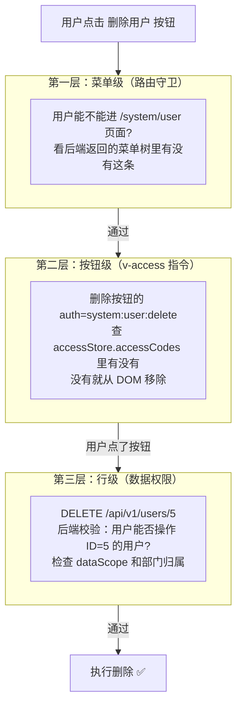

# Chet.Admin 权限模型：菜单级 + 按钮级 + 行级三层防护 🎯

> 《Chet.Admin 全栈实战》系列第 6 篇

---

## 前言

做后台系统，**权限** 是绕不开的核心。

你是不是也遇到过这些坑？

- ❌ 只控菜单，按钮随便点
- ❌ 同一个接口，A 部门能看全公司数据，B 部门只能看自己
- ❌ 前端隐藏了按钮，后端没拦，F12 一抓包照样能调
- ❌ 角色越多越乱，最后没人知道谁有啥权限

**Chet.Admin** 用经典的 **RBAC** 模型，把权限分成 **三层**：

- 🎯 **菜单级**：控制能不能进这个页面
- 🎯 **按钮级**：控制页面里能不能点这个按钮
- 🎯 **行级**：控制能看到哪几行数据

三层叠加，**从粗到细**，覆盖企业 90% 的权限场景。

---

## 一、RBAC 数据模型设计 🗂️

**RBAC**（Role-Based Access Control）的核心思想：**用户不直接拥有权限，而是通过角色间接拥有**。

### 1.1 五张核心表

Chet.Admin 的权限模型由 **5 张表** 组成：

| 表名 | 作用 | 关键字段 |
| ---- | ---- | ---- |
| `Users` | 用户表 | Id、Name、Email、DepartmentId |
| `Roles` | 角色表 | Id、Code、Name、**DataScope** |
| `Menus` | 菜单/权限表 | Id、Name、Path、Type、**Permission** |
| `UserRoles` | 用户-角色关联 | UserId、RoleId |
| `RoleMenus` | 角色-菜单关联 | RoleId、MenuId |
| `RoleDataScopeDepts` | 角色-自定义部门关联 | RoleId、DepartmentId |

> 💡 **关键设计**：用户和权限**多对多**，通过角色解耦。一个用户可以有多个角色，一个角色可以分配多个菜单。

<!-- RBAC 数据模型 ER 图 -->


### 1.2 角色实体 RoleEntity

先看角色表的字段设计：

```csharp
public class RoleEntity : BaseEntity
{
    /// 角色编码（如 admin, user）
    public string Code { get; set; } = string.Empty;

    /// 角色名称
    public string Name { get; set; } = string.Empty;

    /// 角色描述
    public string? Description { get; set; }

    /// 排序号
    public int Sort { get; set; }

    /// 是否启用
    public bool IsEnabled { get; set; } = true;

    /// 数据权限范围：All/Dept/DeptAndChild/Self/Custom
    public string DataScope { get; set; } = "All";

    /// 用户角色关联
    public List<UserRoleEntity> UserRoles { get; set; } = [];

    /// 角色菜单关联
    public List<RoleMenuEntity> RoleMenus { get; set; } = [];

    /// 角色自定义数据权限部门关联
    public List<RoleDataScopeDeptEntity> RoleDataScopeDepts { get; set; } = [];
}
```

**注意** `DataScope` 字段，它**直接挂在角色上**——这意味着**数据权限是角色的属性**，而不是单独的菜单权限。这是 Chet.Admin 的关键设计决策。

### 1.3 关联表设计

用户-角色关联表（**无独立主键**，用复合主键）：

```csharp
public class UserRoleEntity
{
    public int UserId { get; set; }
    public int RoleId { get; set; }
    public UserEntity User { get; set; } = null!;
    public RoleEntity Role { get; set; } = null!;
}
```

角色-菜单关联表同理：

```csharp
public class RoleMenuEntity
{
    public int RoleId { get; set; }
    public int MenuId { get; set; }
    public RoleEntity Role { get; set; } = null!;
    public MenuEntity Menu { get; set; } = null!;
}
```

> 📌 **为什么用关联表而不是 JSON 字段存数组？**
> - 可建索引，查询快
> - 支持外键约束，数据一致
> - 容易做权限反查（"这个菜单被哪些角色拥有？"）

### 1.4 菜单实体：四种类型

菜单表通过 `Type` 字段区分 **4 种类型**，统一管理：

```csharp
public class MenuEntity : BaseEntity
{
    public string Name { get; set; } = string.Empty;
    public string Path { get; set; } = string.Empty;
    public string? Component { get; set; }
    public int ParentId { get; set; }

    /// 菜单类型（Directory=目录, Menu=菜单, Button=按钮, Api=接口）
    public string Type { get; set; } = "Menu";

    /// 权限标识，如 system:user:create
    public string? Permission { get; set; }
}
```

| Type | 含义 | 示例 |
| ---- | ---- | ---- |
| `Directory` | 目录（容器） | 系统管理 |
| `Menu` | 菜单页面 | 用户管理 |
| `Button` | 按钮权限 | 新增按钮 |
| `Api` | 接口权限 | 后端接口 |

> 💡 **核心思想**：**目录、菜单、按钮、接口都在同一张表**，通过 `ParentId` 形成树结构。按钮权限是菜单的子节点，挂在菜单下面。

---

## 二、第一层：菜单级权限 📋

菜单级权限控制**用户能不能访问某个页面**。

### 2.1 后端：返回用户的菜单树

登录后，前端调 `/auth/user-info` 获取用户信息，其中包含 **roles（角色编码列表）** 和 **permissions（权限码列表）**：

```csharp
public async Task<UserInfoDto> GetUserInfoAsync(int userId)
{
    var user = await _unitOfWork.Users.GetByIdAsync(userId);

    // 获取角色
    var roles = await _roleRepository.GetRolesByUserIdAsync(userId);
    // 获取权限码（按钮级别）
    var permissions = await _menuRepository.GetPermissionCodesByUserIdAsync(userId);

    return new UserInfoDto
    {
        Id = user.Id,
        Name = user.Name,
        Email = user.Email,
        Roles = roles.Select(r => r.Code).ToList(),
        Permissions = permissions,
    };
}
```

前端还会单独调 `/menus/my` 拿到**当前用户可见的菜单树**，用于动态生成路由。

### 2.2 前端：路由守卫拦截

Vue Router 的**全局守卫**是菜单权限的第一道闸门：

```typescript
function setupAccessGuard(router: Router) {
  router.beforeEach(async (to, from) => {
    const accessStore = useAccessStore();
    const userStore = useUserStore();
    const authStore = useAuthStore();

    // 1. 公共路由（登录页等）直接放行
    if (coreRouteNames.includes(to.name as string)) {
      if (!accessStore.accessToken || accessStore.isAccessChecked) {
        return true;
      }
    }

    // 2. 没有 Token，跳登录页
    if (!accessStore.accessToken) {
      if (to.meta.ignoreAccess) return true;
      return { path: LOGIN_PATH, query: { redirect: encodeURIComponent(to.fullPath) }, replace: true };
    }

    // 3. 已生成过动态路由，直接放行
    if (accessStore.isAccessChecked) return true;

    // 4. 关键：生成动态路由
    const userInfo = userStore.userInfo || (await authStore.fetchUserInfo());
    const { accessibleMenus, accessibleRoutes } = await generateAccess({
      roles: userInfo.roles ?? [],
      router,
      routes: accessRoutes,
    });

    accessStore.setAccessMenus(accessibleMenus);
    accessStore.setAccessRoutes(accessibleRoutes);
    accessStore.setIsAccessChecked(true);

    // 5. 跳转到目标页（解决刷新后路由丢失问题）
    return { ...router.resolve(decodeURIComponent(redirectPath)), replace: true };
  });
}
```

### 2.3 动态路由生成

`generateAccess` 通过后端菜单数据**动态注册路由**：

```typescript
async function generateAccess(options: GenerateMenuAndRoutesOptions) {
  const pageMap: ComponentRecordType = import.meta.glob('../views/**/*.vue');

  return await generateAccessible(preferences.app.accessMode, {
    ...options,
    // 关键：从后端拉取菜单树
    fetchMenuListAsync: async () => {
      message.loading({ content: `${$t('common.loadingMenu')}...`, duration: 1.5 });
      return await getMyMenusApi();
    },
    forbiddenComponent, // 无权限跳 403
    layoutMap,
    pageMap,
  });
}
```

> 🎯 **核心机制**：
> - **菜单不在前端硬编码**，而是登录后从后端拉取
> - 后端按用户角色过滤，只返回**有权限的菜单**
> - 前端动态注册路由，渲染左侧菜单
> - 用户访问没权限的 URL，会被守卫拦截或跳 403

<!-- 动态路由生成流程 -->


---

## 三、第二层：按钮级权限 🔘

菜单级只控制**能不能进页面**，进了页面后**能不能点新增/删除按钮**，就是按钮级权限的事。

### 3.1 后端：把权限码塞进 JWT

登录签发 Token 时，把用户所有权限码作为 Claim 写入：

```csharp
public async Task<string> GenerateAccessTokenAsync(UserEntity user)
{
    var claims = new List<Claim>
    {
        new Claim(JwtRegisteredClaimNames.Sub, user.Id.ToString()),
        new Claim(JwtRegisteredClaimNames.Email, user.Email),
        new Claim(JwtRegisteredClaimNames.Jti, Guid.NewGuid().ToString()),
        new Claim(ClaimTypes.Name, user.Name),
    };

    // 添加角色 Claims
    var roles = await _roleRepository.GetRolesByUserIdAsync(user.Id);
    foreach (var role in roles)
    {
        claims.Add(new Claim(ClaimTypes.Role, role.Code));
    }

    // 关键：添加权限码 Claims
    var permissions = await _menuRepository.GetPermissionCodesByUserIdAsync(user.Id);
    foreach (var permission in permissions)
    {
        claims.Add(new Claim("permission", permission));
    }

    // ... 签发 JWT
}
```

> 💡 **权限码格式约定**：`模块:资源:操作`，如 `system:user:create`、`system:role:delete`

### 3.2 前端：v-access 指令

Chet.Admin 用一个**全局指令** `v-access` 控制按钮显隐：

```vue
<!-- 单个权限码 -->
<a-button v-access:code="'system:user:create'">新增</a-button>

<!-- 多个权限码（满足其一即可） -->
<a-button v-access:code="['system:user:update', 'system:user:delete']">操作</a-button>
```

指令实现非常精简：

```typescript
function isAccessible(el: Element, binding: DirectiveBinding<string | string[]>) {
  const { accessMode, hasAccessByCodes, hasAccessByRoles } = useAccess();
  const value = binding.value;
  if (!value) return;

  // 根据参数决定按角色还是按权限码判断
  const authMethod =
    accessMode.value === 'frontend' && binding.arg === 'role'
      ? hasAccessByRoles
      : hasAccessByCodes;

  const values = Array.isArray(value) ? value : [value];

  // 无权限直接从 DOM 移除
  if (!authMethod(values)) {
    el?.remove();
  }
}

const authDirective: Directive = { mounted: isAccessible };

export function registerAccessDirective(app: App) {
  app.directive('access', authDirective);
}
```

### 3.3 权限判断核心：useAccess

`hasAccessByCodes` 用 **Set** 做集合交集判断，性能 O(n)：

```typescript
function useAccess() {
  const accessStore = useAccessStore();
  const userStore = useUserStore();

  /// 基于角色判断
  function hasAccessByRoles(roles: string[]) {
    const userRoleSet = new Set(userStore.userRoles);
    return roles.filter((r) => userRoleSet.has(r)).length > 0;
  }

  /// 基于权限码判断
  function hasAccessByCodes(codes: string[]) {
    const userCodesSet = new Set(accessStore.accessCodes);
    return codes.filter((c) => userCodesSet.has(c)).length > 0;
  }

  return { hasAccessByCodes, hasAccessByRoles };
}
```

### 3.4 表格操作列的权限控制

在 VxeTable 的操作列里，每个按钮都用 `auth` 属性挂权限码：

```vue
<VbenTableAction
  :actions="[
    { text: '编辑', auth: 'system:user:update', onClick: () => onEdit(row) },
    { text: '修改密码', auth: 'system:user:update', onClick: () => onChangePwd(row) },
  ]"
  :dropdown-actions="[
    { text: '删除', auth: 'system:user:delete', danger: true, popConfirm: { title: '确认删除？', confirm: () => onDelete(row) } }
  ]"
/>
```

工具栏的新增按钮则用 `hasAccessByCodes` 函数式判断：

```vue
<Button v-if="hasAccessByCodes(['system:user:create'])" type="primary" @click="onCreate">
  <Plus class="mr-2 size-4" />新增
</Button>
```

> ⚠️ **重要提醒**：**前端隐藏按钮只是体验优化**，绝不能依赖它做安全防护！后端必须再校验一次。

---

## 四、第三层：行级权限（数据权限） 🔒

这是最容易被忽略、也最难做的一层。

**场景**：同一个用户列表接口
- 总经理能看全公司
- 部门经理只能看本部门及下属
- 普通员工只能看自己

### 4.1 五种数据权限范围

`RoleEntity.DataScope` 字段定义 **5 种范围**：

| DataScope | 含义 | SQL 过滤效果 |
| ---- | ---- | ---- |
| `All` | 全部数据 | 不加 WHERE |
| `Dept` | 本部门 | `WHERE dept_id = currentUserDept` |
| `DeptAndChild` | 本部门及下级 | `WHERE dept_id IN (本部门+所有子部门)` |
| `Self` | 仅本人 | `WHERE id = currentUserId` |
| `Custom` | 自定义部门 | `WHERE dept_id IN (customDeptIds)` |

> 📌 `Custom` 范围配合 `RoleDataScopeDepts` 关联表，**精细指定**这个角色能看哪些部门的数据。

### 4.2 DataScopeService：核心实现

`DataScopeService` 负责计算**用户可访问的部门 ID 列表**：

```csharp
public class DataScopeService : IDataScopeService
{
    /// 获取用户可访问的部门ID列表
    public async Task<List<int>> GetAccessibleDeptIdsAsync(int userId)
    {
        // 1. 拿到用户的所有角色
        var roleIds = await _dbContext.UserRoles
            .AsNoTracking()
            .Where(ur => ur.UserId == userId)
            .Select(ur => ur.RoleId)
            .ToListAsync();

        if (roleIds.Count == 0) return new List<int>();

        // 2. 拿到这些角色的 DataScope
        var roles = await _dbContext.Roles
            .AsNoTracking()
            .Where(r => roleIds.Contains(r.Id))
            .Select(r => new { r.Id, r.DataScope })
            .ToListAsync();

        // 3. 任一角色是 All，直接返回所有部门
        if (roles.Any(r => r.DataScope == "All"))
            return await _dbContext.Departments.AsNoTracking().Select(d => d.Id).ToListAsync();

        var result = new HashSet<int>();
        var user = await _dbContext.Users.AsNoTracking().FirstOrDefaultAsync(u => u.Id == userId);

        // 4. 遍历每个角色，按范围收集部门ID
        foreach (var role in roles)
        {
            switch (role.DataScope)
            {
                case "Dept":
                    if (user.DepartmentId.HasValue)
                        result.Add(user.DepartmentId.Value);
                    break;

                case "DeptAndChild":
                    if (user.DepartmentId.HasValue)
                    {
                        result.Add(user.DepartmentId.Value);
                        await AddChildDeptsAsync(user.DepartmentId.Value, result);
                    }
                    break;

                case "Self":
                    // Self 不添加任何部门
                    break;

                case "Custom":
                    var customDepts = await _dbContext.RoleDataScopeDepts
                        .AsNoTracking()
                        .Where(rd => rd.RoleId == role.Id)
                        .Select(rd => rd.DepartmentId)
                        .ToListAsync();
                    foreach (var d in customDepts) result.Add(d);
                    break;
            }
        }

        return result.ToList();
    }

    /// 递归获取所有子部门
    private async Task AddChildDeptsAsync(int parentId, HashSet<int> result)
    {
        var children = await _dbContext.Departments
            .AsNoTracking()
            .Where(d => d.ParentId == parentId)
            .Select(d => d.Id)
            .ToListAsync();

        foreach (var child in children)
        {
            if (result.Add(child)) // 避免重复
            {
                await AddChildDeptsAsync(child, result);
            }
        }
    }
}
```

### 4.3 取最宽松范围：GetDataScopeAsync

一个用户有多个角色时，**取最宽松的范围**：

```csharp
public async Task<string> GetDataScopeAsync(int userId)
{
    var scopes = await _dbContext.Roles
        .AsNoTracking()
        .Where(r => roleIds.Contains(r.Id))
        .Select(r => r.DataScope)
        .ToListAsync();

    // 从宽到严：All > DeptAndChild > Dept > Custom > Self
    if (scopes.Contains("All")) return "All";
    if (scopes.Contains("DeptAndChild")) return "DeptAndChild";
    if (scopes.Contains("Dept")) return "Dept";
    if (scopes.Contains("Custom")) return "Custom";
    return "Self";
}
```

> 💡 **设计哲学**：用户**多角色叠加权限就高不就低**——A 角色能看本部门，B 角色能看全部，最终就是能看全部。这符合"权限只增不减"的常识。

### 4.4 在 UserService 里应用过滤

`GetPagedUsersAsync` 根据 dataScope **动态拼接 WHERE**：

```csharp
public async Task<PagedResult<UserDto>> GetPagedUsersAsync(PagedRequest request, int? currentUserId)
{
    var dataScope = await _dataScopeService.GetDataScopeAsync(currentUserId.Value);

    // All 不做过滤
    if (dataScope == "All")
        return await GetPagedUsersAsync(request);

    IQueryable<UserEntity> query = dbContext.Users.AsNoTracking()
        .Include(u => u.UserRoles).ThenInclude(ur => ur.Role);

    switch (dataScope)
    {
        case "Self":
            query = query.Where(u => u.Id == currentUserId.Value);
            break;

        case "Dept":
            var currentUserDept = await dbContext.Users
                .AsNoTracking()
                .Where(u => u.Id == currentUserId.Value)
                .Select(u => u.DepartmentId)
                .FirstOrDefaultAsync();
            query = query.Where(u => u.DepartmentId == currentUserDept);
            break;

        case "DeptAndChild":
        case "Custom":
            var accessibleDeptIds = await _dataScopeService.GetAccessibleDeptIdsAsync(currentUserId.Value);
            query = query.Where(u => accessibleDeptIds.Contains(u.DepartmentId.Value));
            break;
    }

    var totalCount = await query.CountAsync();
    var items = await query.Skip(request.Skip).Take(request.PageSize).ToListAsync();
    return new PagedResult<UserDto>(_mapper.Map<List<UserDto>>(items), request.PageNumber, request.PageSize, totalCount);
}
```

<!-- 数据权限过滤流程 -->


---

## 五、后端基于 Claim 的权限校验 ⚙️

### 5.1 JWT Claim 全量打包

回顾前面 `GenerateAccessTokenAsync`，JWT 里的 Claim 包含三类：

| Claim Type | 值 | 用途 |
| ---- | ---- | ---- |
| `Sub` | 用户 ID | 标识用户 |
| `ClaimTypes.Role` | 角色编码 | 角色判断 |
| `permission` | 权限码 | 按钮判断 |

### 5.2 JWT 验证 + 强制下线

`JwtConfiguration` 配置了**令牌验证回调**，顺便实现**强制下线**：

```csharp
options.Events = new JwtBearerEvents
{
    OnTokenValidated = context =>
    {
        var jwtToken = context.SecurityToken as JwtSecurityToken;
        var userIdClaim = context.Principal?.FindFirst(ClaimTypes.NameIdentifier)
                      ?? context.Principal?.FindFirst(JwtRegisteredClaimNames.Sub);
        if (userIdClaim == null || !int.TryParse(userIdClaim.Value, out var userId))
            return Task.CompletedTask;

        var onlineUserService = context.HttpContext.RequestServices.GetService<IOnlineUserService>();
        // 检查令牌是否已被吊销（签发时间早于吊销时间则拒绝）
        if (onlineUserService.IsTokenRevoked(userId, jwtToken.ValidFrom))
        {
            context.Fail("Token has been revoked");
        }
        return Task.CompletedTask;
    },
};
```

> 🎯 这就是 Chet.Admin **强制下线**的实现原理：管理员在"在线用户"页面把用户踢下线，本质是记录**吊销时间**，后续请求带旧 Token 进来时，`ValidFrom` 早于吊销时间就被拒绝。

### 5.3 控制器层的 [Authorize]

Chet.Admin 的所有管理类控制器都加 `[Authorize]` 特性：

```csharp
[ApiController]
[Route("api/v{version:apiVersion}/[controller]")]
[Authorize]  // 必须登录
public class UsersController : ControllerBase
```

> 💡 **扩展思路**：要更细粒度的接口权限，可以自定义 `[HasPermission("system:user:delete")]` 特性 + `IAuthorizationHandler`，从 Claim 里读 `permission` 类型校验。Chet.Admin 当前用前端按钮控制 + JWT Claim 暴露权限码的方式，足够大多数场景。

---

## 六、三层防护全景图 🗺️

把三层串起来看一个完整请求：



---

## 七、设计要点总结 ✨

### 7.1 三层分工

| 层级 | 控制粒度 | 实现方式 | 性能影响 |
| ---- | ---- | ---- | ---- |
| 菜单级 | 页面级 | 后端菜单树 + 前端动态路由 | 登录时一次 |
| 按钮级 | 操作级 | JWT Claim + v-access 指令 | 几乎为零（Set 查询） |
| 行级 | 数据级 | DataScopeService 动态 WHERE | 每次查询都要算 |

### 7.2 关键设计决策

- ✅ **权限码统一在菜单表管理**，按钮权限作为菜单的子节点
- ✅ **DataScope 挂在角色上**，而不是菜单权限里，避免混淆
- ✅ **多角色权限叠加就高不就低**
- ✅ **JWT 里塞 permission Claim**，前端直接从 Token 拿
- ✅ **前端隐藏 + 后端校验**，双重保险

### 7.3 适用场景

- ✅ 中后台管理系统（用户数 < 10w）
- ✅ 权限规则相对固定
- ✅ 数据权限按部门维度划分
- ❌ 不适合：需要字段级权限（如某列不能看）
- ❌ 不适合：动态权限规则（如"只能操作自己创建的数据"）—— 需要更复杂的 ABAC 模型

---

## 下篇预告

下一篇我们拆解 **认证登录全流程**：注册、登录、验证码、Token Rotation、密码过期策略，一步步看 Chet.Admin 是怎么把登录这件事做扎实的 🔑

---

## 开源地址

- **GitHub**：https://github.com/qiect/Chet.Admin
- **Gitee**：https://gitee.com/qiect/Chet.Admin

觉得有帮助的话，**点个 Star ⭐** 支持一下吧！你的 Star 是我持续更新的动力～

---

## 互动

你的项目里权限是怎么做的？菜单级 + 按钮级 + 行级 三层都覆盖了吗？评论区聊聊～👇

---

> 🔗 GitHub：https://github.com/qiect/Chet.Admin
> 🔗 Gitee：https://gitee.com/qiect/Chet.Admin
> ⭐ 觉得不错的话，点个 Star 支持一下吧！

`#ChetAdmin` `#RBAC` `#权限模型` `#.NET10` `#Vue3` `#数据权限` `#开源项目`
