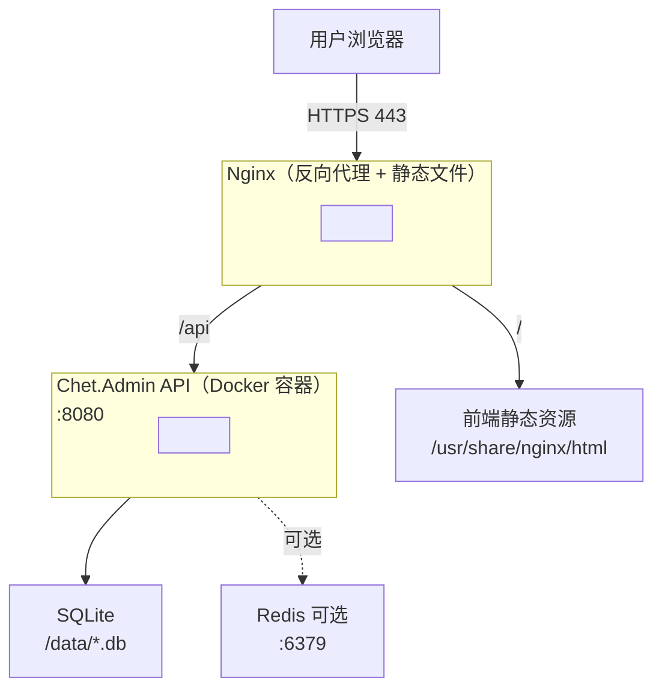

# Chet.Admin 部署指南：Docker + Nginx 一键上线 🐳

> 《Chet.Admin 全栈实战》系列第 20 篇（完结篇）

---

## 前言

代码写完了，本地跑通了，**怎么上线**才是最后一道关卡。

- ❌ 服务器装一堆 .NET SDK / Node.js / Nginx
- ❌ 手动 copy 文件、手动重启服务
- ❌ 数据库、Redis、API、前端各自部署，一团乱麻
- ❌ 服务器一换环境，全部重来

**Chet.Admin** 用 **Docker + Nginx** 的标准方案，**一条 `docker compose up`** 搞定全部。

这是系列最后一篇，我们从部署讲到收尾。🚀

---

## 一、整体架构

部署完成后的架构：



**关键设计**：

- **Nginx 一个容器**：同时托管前端静态文件 + 反向代理 API
- **API 一个容器**：.NET 10 运行时
- **Redis 一个容器**：可选，按需启动
- **SQLite 文件挂载**：数据持久化到宿主机

---

## 二、后端 Dockerfile：多阶段构建

文件位置：`Chet.Admin.Api/Dockerfile`

```dockerfile
FROM mcr.microsoft.com/dotnet/aspnet:10.0 AS base
WORKDIR /app
EXPOSE 8080
EXPOSE 8443

FROM mcr.microsoft.com/dotnet/sdk:10.0 AS build
ARG BUILD_CONFIGURATION=Release
WORKDIR /src
COPY ["Chet.Admin.Api/Chet.Admin.Api.csproj", "Chet.Admin.Api/"]
COPY ["Chet.Admin.Core/Chet.Admin.Contracts/Chet.Admin.Contracts.csproj", "Chet.Admin.Core/Chet.Admin.Contracts/"]
COPY ["Chet.Admin.Core/Chet.Admin.Domain/Chet.Admin.Domain.csproj", "Chet.Admin.Core/Chet.Admin.Domain/"]
COPY ["Chet.Admin.Core/Chet.Admin.Shared/Chet.Admin.Shared.csproj", "Chet.Admin.Core/Chet.Admin.Shared/"]
COPY ["Chet.Admin.Infrastructure/Chet.Admin.Caching/Chet.Admin.Caching.csproj", "Chet.Admin.Infrastructure/Chet.Admin.Caching/"]
COPY ["Chet.Admin.Infrastructure/Chet.Admin.Configuration/Chet.Admin.Configuration.csproj", "Chet.Admin.Infrastructure/Chet.Admin.Configuration/"]
COPY ["Chet.Admin.Infrastructure/Chet.Admin.Data/Chet.Admin.Data.csproj", "Chet.Admin.Infrastructure/Chet.Admin.Data/"]
COPY ["Chet.Admin.Infrastructure/Chet.Admin.Logging/Chet.Admin.Logging.csproj", "Chet.Admin.Infrastructure/Chet.Admin.Logging/"]
COPY ["Chet.Admin.Application/Chet.Admin.DTOs/Chet.Admin.DTOs.csproj", "Chet.Admin.Application/Chet.Admin.DTOs/"]
COPY ["Chet.Admin.Application/Chet.Admin.Mapping/Chet.Admin.Mapping.csproj", "Chet.Admin.Application/Chet.Admin.Mapping/"]
COPY ["Chet.Admin.Application/Chet.Admin.Services/Chet.Admin.Services.csproj", "Chet.Admin.Application/Chet.Admin.Services/"]
RUN dotnet restore "Chet.Admin.Api/Chet.Admin.Api.csproj"
COPY . .
WORKDIR "/src/Chet.Admin.Api"
RUN dotnet build "Chet.Admin.Api.csproj" -c $BUILD_CONFIGURATION -o /app/build

FROM build AS publish
ARG BUILD_CONFIGURATION=Release
RUN dotnet publish "Chet.Admin.Api.csproj" -c $BUILD_CONFIGURATION -o /app/publish /p:UseAppHost=false

FROM base AS final
WORKDIR /app
COPY --from=publish /app/publish .

HEALTHCHECK --interval=30s --timeout=10s --start-period=5s --retries=3 \
    CMD curl -f http://localhost:8080/api/v1/health || exit 1

ENTRYPOINT ["dotnet", "Chet.Admin.Api.dll"]
```

### 2.1 三个阶段

| 阶段 | 镜像 | 作用 |
| ---- | ---- | ---- |
| `base` | `aspnet:10.0` | 运行时基础镜像（小） |
| `build` | `sdk:10.0` | SDK 镜像（大，含构建工具） |
| `final` | `base` | 最终运行镜像 |

**多阶段构建的核心价值**：构建产物进入最终镜像，**SDK 不出现在生产环境**。

- 最终镜像大小约 **150MB**（不含 SDK 的几 GB）
- 攻击面更小，更安全

### 2.2 csproj 先 COPY 再 restore

注意这个细节：

```dockerfile
COPY ["Chet.Admin.Api/Chet.Admin.Api.csproj", "Chet.Admin.Api/"]
# ... 其他 csproj
RUN dotnet restore "Chet.Admin.Api/Chet.Admin.Api.csproj"
COPY . .
```

**先 COPY 所有 csproj，再 restore，最后才 COPY 全部源码**。

为什么？利用 Docker 层缓存：

- 只改了源码 → csproj 没变 → restore 层命中缓存，**秒级完成**
- 改了依赖（csproj 变了）→ 才会重新 restore

如果直接 `COPY . .` 再 restore，每次改一行代码都要重新拉所有 NuGet 包，慢得怀疑人生。

### 2.3 HEALTHCHECK

```dockerfile
HEALTHCHECK --interval=30s --timeout=10s --start-period=5s --retries=3 \
    CMD curl -f http://localhost:8080/api/v1/health || exit 1
```

- **每 30 秒**探一次 `/api/v1/health`
- 超时 10 秒
- 启动后给 5 秒宽限期
- 连续 3 次失败标记为 unhealthy

`docker compose` 会根据这个判断容器是否健康，配合 `restart: unless-stopped` 自动恢复。

---

## 三、前端构建：pnpm build:antd

前端用 Vben Admin 的 Monorepo，构建命令是 `pnpm build:antd`。

### 3.1 构建命令

```bash
cd Chet.Admin.Web
pnpm install
pnpm build:antd
```

产物在 `Chet.Admin.Web/apps/web-antd/dist/`。

### 3.2 环境变量

`.env.production` 文件：

```bash
VITE_BASE=/

# 接口地址
VITE_GLOB_API_URL=/api/v1

# 是否开启压缩，可以设置为 none, brotli, gzip
VITE_COMPRESS=none

# 是否开启 PWA
VITE_PWA=false

# vue-router 的模式
VITE_ROUTER_HISTORY=hash

# 是否注入全局 loading
VITE_INJECT_APP_LOADING=true

# 打包后是否生成 dist.zip
VITE_ARCHIVER=true
```

**关键点**：

- `VITE_GLOB_API_URL=/api/v1`：用相对路径，由 Nginx 代理到后端
- `VITE_ROUTER_HISTORY=hash`：用 hash 模式，避免 Nginx 配置 history fallback
- `VITE_COMPRESS=none`：交给 Nginx 做 gzip，前端不重复压缩
- `VITE_ARCHIVER=true`：构建完自动打包成 zip

### 3.3 生产构建的 Vite 配置

`vite.config.ts`：

```typescript
import { defineConfig } from '@vben/vite-config';

export default defineConfig(async () => {
  return {
    application: {},
    vite: {
      server: {
        proxy: {
          '/api': {
            changeOrigin: true,
            // 后端API地址
            target: 'http://localhost:5000',
            ws: true,
          },
          // 静态资源（上传的文件）代理
          '/uploads': {
            changeOrigin: true,
            target: 'http://localhost:5000',
          },
        },
      },
    },
  };
});
```

注意：**proxy 配置只在开发模式生效**，生产环境由 Nginx 接管代理职责。

### 3.4 产物结构

```
dist/
├── index.html
├── assets/
│   ├── index-abc123.js
│   ├── index-abc123.css
│   └── ...
└── ...
```

把这个 `dist/` 目录扔给 Nginx 托管即可。

---

## 四、Nginx 配置

### 4.1 nginx.conf

```nginx
server {
    listen 80;
    server_name your-domain.com;

    # 前端静态资源
    root /usr/share/nginx/html;
    index index.html;

    # gzip 压缩
    gzip on;
    gzip_vary on;
    gzip_min_length 1024;
    gzip_types text/plain text/css application/json application/javascript
               text/xml application/xml application/xml+rss text/javascript
               image/svg+xml;
    gzip_comp_level 6;

    # 反向代理 API
    location /api/ {
        proxy_pass http://api:8080;
        proxy_set_header Host $host;
        proxy_set_header X-Real-IP $remote_addr;
        proxy_set_header X-Forwarded-For $proxy_add_x_forwarded_for;
        proxy_set_header X-Forwarded-Proto $scheme;

        # WebSocket 支持（在线用户追踪用）
        proxy_http_version 1.1;
        proxy_set_header Upgrade $http_upgrade;
        proxy_set_header Connection "upgrade";

        # 超时设置
        proxy_read_timeout 90s;
        proxy_send_timeout 90s;
    }

    # 上传文件代理
    location /uploads/ {
        proxy_pass http://api:8080;
        proxy_set_header Host $host;
    }

    # SPA 入口（hash 模式不需要 fallback）
    location / {
        try_files $uri $uri/ /index.html;
    }

    # 静态资源长缓存
    location ~* \.(js|css|png|jpg|jpeg|gif|ico|svg|woff|woff2|ttf|eot)$ {
        expires 1y;
        add_header Cache-Control "public, immutable";
    }
}
```

### 4.2 关键配置说明

**gzip 压缩**：

```nginx
gzip on;
gzip_comp_level 6;
```

文本资源压缩率通常 **60%-80%**，1MB 的 JS 压完 200KB。

**反向代理 API**：

```nginx
location /api/ {
    proxy_pass http://api:8080;
}
```

`api` 是 `docker-compose.yml` 里的服务名，Docker 内部 DNS 自动解析。

**WebSocket 支持**：

```nginx
proxy_http_version 1.1;
proxy_set_header Upgrade $http_upgrade;
proxy_set_header Connection "upgrade";
```

Chet.Admin 的在线用户追踪、强制下线等功能依赖 WebSocket，**必须配置 Upgrade 头**。

**静态资源长缓存**：

```nginx
location ~* \.(js|css|png|...)$ {
    expires 1y;
    add_header Cache-Control "public, immutable";
}
```

Vite 构建产物带 hash（`index-abc123.js`），内容变了 hash 就变，可以放心长缓存。

---

## 五、docker-compose 编排

文件位置：`Chet.Admin.Api/docker-compose.yml`：

```yaml
version: '3.8'

services:
  api:
    build:
      context: .
      dockerfile: Dockerfile
    container_name: chet-webapi
    ports:
      - "8080:8080"
      - "8443:8443"
    environment:
      - ASPNETCORE_URLS=http://+:8080;https://+:8443
      - ASPNETCORE_ENVIRONMENT=Production
      - ConnectionStrings__DefaultConnection=Data Source=/data/Chet.Admin.db
      - JWT__SECRETKEY=${JWT_SECRET_KEY:-YourSecretKeyForJWTAuthentication1234567890}
      - Redis__Enabled=false
    volumes:
      - app-data:/data
      - logs-data:/app/logs
    healthcheck:
      test: ["CMD", "curl", "-f", "http://localhost:8080/api/v1/health"]
      interval: 30s
      timeout: 10s
      retries: 3
      start_period: 15s
    restart: unless-stopped
    networks:
      - app-network

  redis:
    image: redis:7-alpine
    container_name: chet-redis
    ports:
      - "6379:6379"
    volumes:
      - redis-data:/data
    command: redis-server --appendonly yes --maxmemory 256mb --maxmemory-policy allkeys-lru
    healthcheck:
      test: ["CMD", "redis-cli", "ping"]
      interval: 30s
      timeout: 5s
      retries: 3
    restart: unless-stopped
    networks:
      - app-network
    profiles:
      - with-redis

volumes:
  app-data:
    driver: local
  logs-data:
    driver: local
  redis-data:
    driver: local

networks:
  app-network:
    driver: bridge
```

### 5.1 关键设计点

**环境变量覆盖配置**：

```yaml
environment:
  - ConnectionStrings__DefaultConnection=Data Source=/data/Chet.Admin.db
  - JWT__SECRETKEY=${JWT_SECRET_KEY:-YourSecretKeyForJWTAuthentication1234567890}
  - Redis__Enabled=false
```

ASP.NET Core 的环境变量会**自动覆盖 appsettings.json**，分隔符 `__` 表示层级。

- `ConnectionStrings__DefaultConnection` → 覆盖 `ConnectionStrings:DefaultConnection`
- `JWT__SECRETKEY` → 覆盖 `Jwt:SecretKey`
- **`Redis__Enabled=false`**：默认不用 Redis，开箱即用

**数据持久化**：

```yaml
volumes:
  - app-data:/data          # SQLite 数据库文件
  - logs-data:/app/logs      # Serilog 日志
  - redis-data:/data         # Redis 持久化
```

容器删了，数据还在。

**Redis 可选**：

```yaml
redis:
  profiles:
    - with-redis
```

`profiles` 表示这个服务**默认不启动**，需要时显式指定：

```bash
# 不带 Redis（默认）
docker compose up -d

# 带 Redis
docker compose --profile with-redis up -d
```

**重启策略**：

```yaml
restart: unless-stopped
```

- 容器崩溃 → 自动重启
- 你手动 `docker stop` → 不会重启
- 服务器重启 → 自动恢复服务

### 5.2 启动顺序

```bash
# 构建 + 启动
docker compose up -d --build

# 查看日志
docker compose logs -f api

# 停止
docker compose down

# 停止并删除数据（小心！）
docker compose down -v
```

---

## 六、生产部署完整流程

### 6.1 准备服务器

最低配置：

- **2 核 CPU / 2GB 内存**
- **20GB 硬盘**
- **Ubuntu 22.04 LTS**（推荐）

安装 Docker：

```bash
# 安装 Docker
curl -fsSL https://get.docker.com | sh

# 加入 docker 组（免 sudo）
sudo usermod -aG docker $USER

# 重新登录后验证
docker --version
docker compose version
```

### 6.2 拉取代码

```bash
git clone https://github.com/yourname/Chet.Admin.git
cd Chet.Admin
```

### 6.3 配置环境变量

在 `Chet.Admin.Api/` 目录下创建 `.env` 文件：

```bash
# JWT 密钥（至少 32 字符，生产环境必改！）
JWT_SECRET_KEY=YourSuperSecretKeyForJWTAuthentication_AtLeast_32_Chars

# 可选：数据库连接（如果用 MySQL/PostgreSQL）
# DB_CONNECTION=Server=mysql;Database=chet_admin;User=root;Password=yourpassword
```

> ⚠️ `.env` 文件**不要提交到 git**，已经默认在 `.gitignore` 里。

### 6.4 构建前端

```bash
cd Chet.Admin.Web
pnpm install
pnpm build:antd
```

构建完成后，把 `apps/web-antd/dist/` 拷贝到 Nginx 目录：

```bash
# 创建 Nginx 静态目录
sudo mkdir -p /usr/share/nginx/html

# 拷贝前端产物
sudo cp -r apps/web-antd/dist/* /usr/share/nginx/html/
```

### 6.5 启动后端

```bash
cd Chet.Admin.Api

# 构建并启动
docker compose up -d --build

# 验证
docker compose ps
docker compose logs -f api
```

看到 `Application started successfully` 就说明启动成功了。

### 6.6 配置 Nginx

```bash
# 安装 Nginx
sudo apt install -y nginx

# 拷贝配置（参考第四节）
sudo nano /etc/nginx/conf.d/chet-admin.conf

# 测试配置
sudo nginx -t

# 重载
sudo nginx -s reload
```

### 6.7 一键部署脚本

可以写个 `deploy.sh` 一键完成：

```bash
#!/bin/bash
set -e

echo "▶ 构建前端..."
cd Chet.Admin.Web
pnpm install
pnpm build:antd

echo "▶ 部署前端静态文件..."
sudo rm -rf /usr/share/nginx/html/*
sudo cp -r apps/web-antd/dist/* /usr/share/nginx/html/

echo "▶ 构建并启动后端..."
cd ../Chet.Admin.Api
docker compose up -d --build

echo "▶ 重载 Nginx..."
sudo nginx -s reload

echo "✓ 部署完成！"
docker compose ps
```

加执行权限：

```bash
chmod +x deploy.sh
./deploy.sh
```

<!-- 部署完成截图 -->


---

## 七、生产环境清单

上线前对照这份清单逐项检查：

### 7.1 安全

- ✅ **JWT 密钥**：至少 32 字符，使用强随机串
- ✅ **HTTPS**：用 Let's Encrypt 申请免费证书
- ✅ **数据库密码**：强密码，不暴露在公网
- ✅ **防火墙**：只开放 80/443，**不暴露 8080/6379 到公网**
- ✅ **CORS**：生产环境限制 `allowedHosts`
- ✅ **限流**：开启 API 限流防暴力破解

### 7.2 HTTPS 配置

用 Let's Encrypt 申请免费证书：

```bash
# 安装 certbot
sudo apt install -y certbot python3-certbot-nginx

# 申请证书（自动修改 Nginx 配置）
sudo certbot --nginx -d your-domain.com

# 自动续期（certbot 默认装了 systemd timer）
sudo systemctl status certbot.timer
```

Nginx 配置加上 443 监听：

```nginx
server {
    listen 443 ssl http2;
    server_name your-domain.com;

    ssl_certificate /etc/letsencrypt/live/your-domain.com/fullchain.pem;
    ssl_certificate_key /etc/letsencrypt/live/your-domain.com/privkey.pem;

    # 其余配置同第四节
}

# HTTP 强制跳转 HTTPS
server {
    listen 80;
    server_name your-domain.com;
    return 301 https://$host$request_uri;
}
```

### 7.3 日志

- ✅ **Serilog 文件日志**：挂载 `/app/logs` 到宿主机
- ✅ **Nginx 访问日志**：定期切割，避免撑满磁盘
- ✅ **Docker 日志限制**：避免日志膨胀

```bash
# /etc/docker/daemon.json
{
  "log-driver": "json-file",
  "log-opts": {
    "max-size": "100m",
    "max-file": "5"
  }
}
```

### 7.4 数据备份

**SQLite 备份**（最简单）：

```bash
# 每天备份
crontab -e
# 加一行：每天凌晨 3 点备份
0 3 * * * cp /var/lib/docker/volumes/chet-admin_api_app-data/_data/Chet.Admin.db /backup/Chet.Admin-$(date +\%Y\%m\%d).db
```

**MySQL/PostgreSQL 备份**：

```bash
# MySQL
docker exec mysql mysqldump -u root -p chet_admin > backup.sql

# PostgreSQL
docker exec postgres pg_dump -U postgres chet_admin > backup.sql
```

### 7.5 监控

- ✅ **Docker healthcheck**：API 和 Redis 都配置了
- ✅ **Nginx status**：开启 `stub_status`
- ✅ **服务器监控**：用 Netdata / Prometheus 监控 CPU/内存/磁盘

---

## 八、常见问题

### Q1: 容器启动后立即退出？

查看日志：

```bash
docker compose logs api
```

常见原因：

- **JWT 密钥太短**：至少 32 字符
- **数据库连接字符串错误**
- **端口被占用**

### Q2: 前端访问 API 返回 502？

- 检查 `api` 容器是否启动：`docker compose ps`
- 检查 Nginx 配置里 `proxy_pass http://api:8080` 的服务名是否对得上
- 检查 API 健康检查：`curl http://localhost:8080/api/v1/health`

### Q3: 上传文件后访问 404？

`/uploads` 路径需要代理到 API 容器，检查 Nginx 配置：

```nginx
location /uploads/ {
    proxy_pass http://api:8080;
}
```

或者把 `/uploads` 也挂载到 Nginx 容器共享。

### Q4: Docker 构建特别慢？

- **用国内镜像源**：在 `daemon.json` 配置 `registry-mirrors`
- **Docker 层缓存**：csproj 不变时，restore 层会命中缓存
- **多阶段构建**：最终镜像不含 SDK，体积小

### Q5: 服务器内存只有 1GB 够用吗？

勉强够，但建议 2GB 起步。可以：

- 关闭 Redis（`Redis__Enabled=false`）
- 限制 .NET 内存：`DOTNET_GCHeapHardLimit=1g`
- 用 swap 临时缓解

---

## 九、系列完结语

20 篇文章，到这里就结束了。

### 9.1 我们一起走过的路

回顾这 20 篇内容：

| 篇目 | 主题 |
| ---- | ---- |
| 01 | 开篇总览 |
| 02 | 快速上手 |
| 03 | 项目结构 |
| 04 | 后端分层架构 |
| 05 | JWT 认证与安全 |
| 06 | RBAC 权限模型 |
| 07-17 | 13 个功能模块详解 |
| 18 | 时间时区统一方案 |
| 19 | 项目重命名指南 |
| 20 | 部署上线（本篇） |

从架构到代码，从认证到部署，**Chet.Admin** 的每一个角落都拆解给你看了。

### 9.2 为什么写这个系列

市面上的开源项目不少，但：

- 📚 **文档跟不上代码**的很多
- 📚 **能跑起来但讲不清为什么**的很多
- 📚 **功能堆砌但缺乏架构思考**的很多

我想做一套**真正能学到东西**的项目和文档：

- ✅ 每个模块都讲设计思路，不是贴代码就完事
- ✅ 每个"为什么"都解释，不照搬"最佳实践"
- ✅ 从架构到部署，全链路打通

希望对你有帮助。🙏

### 9.3 这套系统能用在哪

- 🏢 **企业内部管理系统**：开箱即用的 RBAC + 审计
- 🛒 **SaaS 后台**：多角色权限 + 数据权限
- 📊 **数据看板**：仪表盘 + API 限流
- 🎓 **学习参考**：Clean Architecture + Vue3 Monorepo 实战

### 9.4 接下来

如果你想：

- **二开成自己的产品**：参考第 19 篇用 `chet-rename` 一键改名
- **生产部署**：参考本篇用 Docker + Nginx 上线
- **学习某个模块**：翻对应篇章，代码注释很详细
- **贡献代码**：欢迎提 PR，issue 里聊聊你的想法
- **反馈问题**：到 GitHub issue 区，我尽量回复

### 9.5 最后

写这个系列花了挺多时间，如果能帮到你：

- ⭐ **点个 Star** 是对作者最大的鼓励
- 🔄 **转发给需要的朋友**
- 💬 **评论区交流你的看法**

你的支持是我持续开源的动力。

---

## 开源地址

- **GitHub**：https://github.com/qiect/Chet.Admin
- **Gitee**：https://gitee.com/qiect/Chet.Admin

觉得有帮助的话，**点个 Star ⭐** 支持一下吧！

有问题欢迎提 issue，喜欢贡献代码欢迎提 PR。这个项目会持续维护，**下个版本见**！👋

---

## 系列目录

- [01 - 开篇总览](/articles/01-overview)
- [02 - 快速上手](/articles/02-quick-start)
- [03 - 项目结构](/articles/03-project-structure)
- [04 - 后端分层架构](/articles/04-backend-architecture)
- [05 - JWT 认证与安全](/articles/05-jwt-auth)
- [06 - RBAC 权限模型](/articles/06-rbac)
- [07-17 - 13 个功能模块详解](/articles/overview)
- [18 - 时间时区统一方案](/articles/18-timezone)
- [19 - 项目重命名指南](/articles/19-rename)
- **20 - 部署上线（本篇）**

---

> 🔗 GitHub：https://github.com/qiect/Chet.Admin
> 🔗 Gitee：https://gitee.com/qiect/Chet.Admin
> ⭐ 觉得不错的话，点个 Star 支持一下吧！

`#ChetAdmin` `#全栈开发` `#.NET10` `#Vue3` `#Docker` `#Nginx` `#部署上线` `#系列完结`
