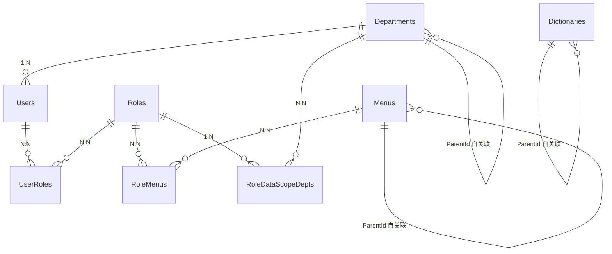

# 数据库设计

## 1. 概述

系统采用 EF Core 作为 ORM，通过 Code First 模式管理数据库：

- **开发环境**：SQLite（数据库文件 `Chet.Admin.db`，启动自动创建）
- **生产环境**：PostgreSQL（推荐）
- **数据库上下文**：`AppDbContext`（位于 `Chet.Admin.Data` 项目）

实体配置通过 Fluent API 在 `Data/{Module}/{Entity}Config.cs` 中定义，启动时自动迁移并写入种子数据。

## 2. RBAC 权限模型

系统核心是 RBAC（基于角色的访问控制）模型：



### 关系说明

- **用户 ↔ 角色**：多对多（通过 `UserRole` 中间表）
- **角色 ↔ 菜单**：多对多（通过 `RoleMenu` 中间表）
- **角色 → 数据权限范围**：一对一（`Role.DataScope` 字段），自定义范围通过 `RoleDataScopeDept` 关联部门
- **用户 → 部门**：多对一（`User.DepartmentId`）

## 3. 实体 ER 图

```mermaid
erDiagram
    Users {
        int Id PK
        string Name
        string Email UQ
        string PasswordHash
        string RefreshToken
        int DepartmentId FK
        int LoginFailCount
        datetime LockedUntil
    }
    Roles {
        int Id PK
        string Code
        string Name
        string DataScope
        bool IsEnabled
    }
    UserRoles {
        int UserId PK,FK
        int RoleId PK,FK
    }
    Menus {
        int Id PK
        int ParentId
        string Path
        string Icon
        string Type
        int Sort
    }
    RoleMenus {
        int RoleId PK,FK
        int MenuId PK,FK
    }
    Departments {
        int Id PK
        int ParentId
        string Name
        string Code
        string Leader
    }
    RoleDataScopeDepts {
        int Id PK
        int RoleId FK
        int DepartmentId FK
    }

    Users ||--o{ UserRoles : "UserId"
    Roles ||--o{ UserRoles : "RoleId"
    Roles ||--o{ RoleMenus : "RoleId"
    Menus ||--o{ RoleMenus : "MenuId"
    Departments ||--o{ Users : "DepartmentId"
    Roles ||--o{ RoleDataScopeDepts : "RoleId"
    Departments ||--o{ RoleDataScopeDepts : "DepartmentId"
```

## 4. 数据表结构

### 4.1 Users（用户表）

继承 `BaseEntity`（含 `Id`、`CreatedAt`、`UpdatedAt`）。

| 字段 | 类型 | 约束 | 说明 |
| ---- | ---- | ---- | ---- |
| Id | INT | PK, 自增 | 主键 |
| Name | NVARCHAR(100) | NOT NULL | 用户名 |
| Email | NVARCHAR(255) | NOT NULL, UNIQUE | 邮箱（登录凭证） |
| PasswordHash | NVARCHAR(MAX) | NOT NULL | BCrypt 哈希 |
| RefreshToken | NVARCHAR(MAX) | NULL | 刷新令牌 |
| RefreshTokenExpiryTime | DATETIME2 | NULL | 刷新令牌过期时间 |
| Avatar | NVARCHAR | NULL | 头像 URL |
| DepartmentId | INT | NULL, FK | 部门 ID |
| LoginFailCount | INT | 默认 0 | 连续登录失败次数 |
| LockedUntil | DATETIME2 | NULL | 锁定截止时间 |
| PasswordChangedAt | DATETIME2 | NULL | 密码最后修改时间 |
| MustChangePassword | BIT | 默认 0 | 是否强制改密 |
| CreatedAt | DATETIME2 | 自动 | 创建时间（UTC） |
| UpdatedAt | DATETIME2 | 自动 | 更新时间（UTC） |

### 4.2 Roles（角色表）

| 字段 | 类型 | 约束 | 说明 |
| ---- | ---- | ---- | ---- |
| Id | INT | PK | 主键 |
| Code | NVARCHAR | NOT NULL | 角色编码（如 admin） |
| Name | NVARCHAR | NOT NULL | 角色名称 |
| Description | NVARCHAR | NULL | 描述 |
| Sort | INT | 默认 0 | 排序 |
| IsEnabled | BIT | 默认 1 | 是否启用 |
| DataScope | NVARCHAR | 默认 All | 数据权限范围 |
| CreatedAt / UpdatedAt | DATETIME2 | 自动 | 时间戳 |

### 4.3 Menus（菜单表）

| 字段 | 类型 | 约束 | 说明 |
| ---- | ---- | ---- | ---- |
| Id | INT | PK | 主键 |
| Name | NVARCHAR | NOT NULL | 菜单名称 |
| Path | NVARCHAR | NOT NULL | 路由路径 |
| Component | NVARCHAR | NULL | 组件路径 |
| Redirect | NVARCHAR | NULL | 重定向路径 |
| Icon | NVARCHAR | NULL | 图标 |
| ParentId | INT | 默认 0 | 父菜单 ID（0=顶级） |
| Type | NVARCHAR | 默认 Menu | 类型：Directory/Menu/Button/Api |
| Sort | INT | 默认 0 | 排序 |
| IsEnabled | BIT | 默认 1 | 是否启用 |
| IsExternal | BIT | 默认 0 | 是否外链 |
| Description | NVARCHAR(200) | NULL | 权限/按钮描述 |
| CreatedAt / UpdatedAt | DATETIME2 | 自动 | 时间戳 |

### 4.4 Departments（部门表）

| 字段 | 类型 | 约束 | 说明 |
| ---- | ---- | ---- | ---- |
| Id | INT | PK | 主键 |
| Name | NVARCHAR | NOT NULL | 部门名称 |
| Code | NVARCHAR | NOT NULL | 部门编码 |
| Leader | NVARCHAR | NULL | 负责人 |
| Phone | NVARCHAR | NULL | 联系电话 |
| Email | NVARCHAR | NULL | 邮箱 |
| ParentId | INT | 默认 0 | 父部门 ID（0=顶级） |
| Sort | INT | 默认 0 | 排序 |
| IsEnabled | BIT | 默认 1 | 是否启用 |
| CreatedAt / UpdatedAt | DATETIME2 | 自动 | 时间戳 |

### 4.5 Dictionaries（字典表）

| 字段 | 类型 | 约束 | 说明 |
| ---- | ---- | ---- | ---- |
| Id | INT | PK | 主键 |
| DictType | NVARCHAR | NOT NULL | 字典类型编码（如 user_status） |
| Name | NVARCHAR | NOT NULL | 字典名称 |
| Value | NVARCHAR | NOT NULL | 字典值 |
| Label | NVARCHAR | NOT NULL | 显示标签 |
| Sort | INT | 默认 0 | 排序 |
| IsEnabled | BIT | 默认 1 | 是否启用 |
| Remark | NVARCHAR | NULL | 备注 |
| ParentId | INT | NULL | 父级 ID（类型项为 null） |
| CreatedAt / UpdatedAt | DATETIME2 | 自动 | 时间戳 |

### 4.6 关联表

#### UserRoles（用户-角色）

| 字段 | 类型 | 约束 |
| ---- | ---- | ---- |
| UserId | INT | PK, FK → Users.Id |
| RoleId | INT | PK, FK → Roles.Id |

#### RoleMenus（角色-菜单）

| 字段 | 类型 | 约束 |
| ---- | ---- | ---- |
| RoleId | INT | PK, FK → Roles.Id |
| MenuId | INT | PK, FK → Menus.Id |

#### RoleDataScopeDepts（角色-自定义数据权限部门）

| 字段 | 类型 | 约束 |
| ---- | ---- | ---- |
| Id | INT | PK |
| RoleId | INT | FK → Roles.Id |
| DepartmentId | INT | FK → Departments.Id |

### 4.7 AuditLogs（操作日志表）

> 此表不继承 `BaseEntity`，自带主键与时间字段。

| 字段 | 类型 | 约束 | 说明 |
| ---- | ---- | ---- | ---- |
| Id | INT | PK | 主键 |
| UserId | INT | | 操作人 ID |
| UserName | NVARCHAR | NOT NULL | 操作人用户名 |
| Action | NVARCHAR | NOT NULL | 操作类型（Create/Update/Delete/Login/Logout/Assign） |
| Module | NVARCHAR | NOT NULL | 模块（User/Role/Menu/Auth 等） |
| Description | NVARCHAR | NOT NULL | 操作描述 |
| TargetId | NVARCHAR | NULL | 操作目标 ID |
| HttpMethod | NVARCHAR | NOT NULL | 请求方法 |
| RequestPath | NVARCHAR | NOT NULL | 请求路径 |
| RequestData | NVARCHAR(MAX) | NULL | 请求参数（JSON） |
| StatusCode | INT | | 响应状态码 |
| ClientIp | NVARCHAR | NOT NULL | 客户端 IP |
| UserAgent | NVARCHAR | NULL | User-Agent |
| Duration | BIGINT | | 执行耗时（ms） |
| OperatedAt | DATETIME2 | 默认 UTC | 操作时间 |

### 4.8 Notifications（通知表）

| 字段 | 类型 | 约束 | 说明 |
| ---- | ---- | ---- | ---- |
| Id | INT | PK | 主键 |
| Title | NVARCHAR | NOT NULL | 通知标题 |
| Content | NVARCHAR | NOT NULL | 通知内容（支持 HTML） |
| Type | NVARCHAR | 默认 Notification | 类型：Announcement/Notification/Todo |
| Priority | NVARCHAR | 默认 Normal | 优先级：Low/Normal/High/Urgent |
| SenderId | INT | NULL | 发送人 ID（null=系统） |
| IsGlobal | BIT | 默认 0 | 是否全局公告 |
| CreatedAt | DATETIME2 | 默认 UTC | 创建时间 |

#### NotificationRecipients（通知接收表）

| 字段 | 类型 | 约束 | 说明 |
| ---- | ---- | ---- | ---- |
| Id | INT | PK | 主键 |
| NotificationId | INT | FK | 通知 ID |
| UserId | INT | FK | 接收用户 ID |
| IsRead | BIT | 默认 0 | 是否已读 |
| ReadAt | DATETIME2 | NULL | 阅读时间 |

### 4.9 Files（文件表）

| 字段 | 类型 | 约束 | 说明 |
| ---- | ---- | ---- | ---- |
| Id | INT | PK | 主键 |
| FileName | NVARCHAR | NOT NULL | 原始文件名 |
| StoredName | NVARCHAR | NOT NULL | 存储文件名（GUID） |
| FilePath | NVARCHAR | NOT NULL | 相对路径 |
| ContentType | NVARCHAR | NOT NULL | MIME 类型 |
| FileSize | BIGINT | | 文件大小（bytes） |
| Description | NVARCHAR | NULL | 描述 |
| UploaderId | INT | NULL | 上传人 ID |
| CreatedAt | DATETIME2 | 默认 UTC | 上传时间 |

## 5. 种子数据

首次启动时自动初始化以下数据：

- **管理员用户**：`admin@example.com` / `Admin@123`
- **角色**：超级管理员（admin）
- **菜单**：系统管理相关菜单树（含 Button/Api 权限节点）
- **部门**：根部门
- **字典**：`user_status`、`menu_type`、`gender`、`yes_no` 等

## 6. 数据库迁移命令

```bash
# 进入后端目录
cd Chet.Admin.Api

# 生成新迁移
dotnet ef migrations add <迁移名称> \
  --project Chet.Admin.Infrastructure/Chet.Admin.Data \
  --startup-project Chet.Admin.Api

# 应用迁移到数据库
dotnet ef database update \
  --project Chet.Admin.Infrastructure/Chet.Admin.Data \
  --startup-project Chet.Admin.Api

# 移除最后一个迁移
dotnet ef migrations remove \
  --project Chet.Admin.Infrastructure/Chet.Admin.Data \
  --startup-project Chet.Admin.Api
```

> 启动时 `DatabaseConfiguration` 会自动执行 `EnsureCreated` / 迁移并写入种子数据，开发环境通常无需手动执行迁移命令。

## 7. 切换到 PostgreSQL

生产环境推荐使用 PostgreSQL：

1. 修改 `appsettings.json` 连接字符串：

```json
{
  "ConnectionStrings": {
    "DefaultConnection": "Host=localhost;Database=chet_admin;Username=postgres;Password=yourpassword"
  }
}
```

2. 在 `Chet.Admin.Data.csproj` 中引用 PostgreSQL EF Core 提供程序

3. 在 `DatabaseConfiguration.cs` 中将 `UseSqlite` 替换为 `UseNpgsql`

4. 执行迁移命令生成 PostgreSQL 数据库结构
