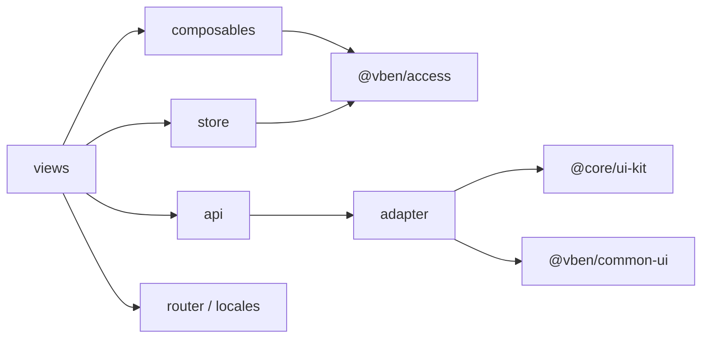

# 前端架构

## 1. 架构概述

Chet.Admin 前端位于 `Chet.Admin.Web/`，是基于 **[Vben Admin v5.7](https://vben.pro)** 的 pnpm Monorepo 工程，采用前后端分离架构。业务开发集中在主应用 `apps/web-antd`（Ant Design Vue 技术栈），后端通过 RESTful API 提供服务。

工程根 `package.json` 中明确声明：

```json
{
  "name": "vben-admin-monorepo",
  "version": "5.7.0",
  "packageManager": "pnpm@11.7.0"
}
```

### 1.1 架构目标

- **解耦**：Monorepo 把框架核心、工具链、业务应用分层管理，互不侵入
- **可复用**：`packages/@core` 提供可复用的 UI Kit、偏好设置、工具函数
- **可扩展**：新增业务模块只需在 `apps/web-antd/src/views` 增加页面与 API
- **类型安全**：全量 TypeScript，共享 `@vben/types` 类型定义
- **权限可控**：菜单由后端返回，前端按角色 permissions 生成动态路由与按钮权限

### 1.2 Monorepo 顶层结构

```tree
Chet.Admin.Web/
├── apps/                # 业务应用
│   ├── web-antd/        # 主应用（Ant Design Vue）
│   └── backend-mock/    # Nitro Mock 服务
├── internal/            # 内部工具包（不发布）
│   ├── lint-configs/    # ESLint / Oxlint / Stylelint / Commitlint
│   ├── node-utils/      # Node 端工具函数（vsh 命令）
│   ├── tailwind-config/ # Tailwind CSS v4 预设
│   ├── tsconfig/        # TS 配置分层（base/web/library/node）
│   └── vite-config/     # Vite 构建配置封装
├── packages/            # 可复用包
│   ├── @core/           # 核心包（design/icons/shared/typings/composables/preferences/ui-kit）
│   ├── effects/         # 副作用包（access/common-ui）
│   └── constants/       # 全局常量
├── playground/          # 框架示例与演示
├── package.json
├── pnpm-workspace.yaml
└── turbo.json
```

## 2. 技术栈

| 类别 | 技术 | 说明 |
| ---- | ---- | ---- |
| UI 框架 | Vue 3（Composition API） | 全量 `<script setup>` 写法 |
| 语言 | TypeScript | 全量类型覆盖，`vue-tsc` 校验 |
| 构建工具 | Vite | 开发即热更新，生产构建基于 Rollup |
| UI 组件库 | Ant Design Vue | 主应用组件来源 |
| 状态管理 | Pinia | 应用级 `auth` store + 框架级 `accessStore` |
| 路由 | Vue Router | 动态路由 + 守卫 + 懒加载 |
| 表格 | VxeTable | 高性能虚拟滚动表格 |
| 样式 | Tailwind CSS v4 | 原子化样式，配合 `@vben/tailwind-config` 预设 |
| 包管理 | pnpm + Turbo | Workspace 协议 + 增量构建 |
| HTTP 客户端 | Axios | 由 `@vben/request` 封装，统一拦截器 |
| 图表 | ECharts | 通过 `@vben/plugins` 注入 |
| 国际化 | vue-i18n | `zh-CN` / `en-US` 双语 |

## 3. Monorepo 结构详解

### 3.1 apps/ —— 业务应用

- **`apps/web-antd`**：主应用，业务代码全部位于 `src/` 下，是日常开发的唯一入口
- **`apps/backend-mock`**：基于 [Nitro](https://nitro.build/) 的本地 Mock 服务，开发期可通过 `VITE_NITRO_MOCK=true` 启用，本项目默认关闭（直接对接真实后端）

### 3.2 internal/ —— 内部工具包

仅工程内部使用，不对外发布：

| 包 | 作用 |
| ---- | ---- |
| `lint-configs` | 统一 ESLint / Oxlint / Stylelint / Commitlint 配置 |
| `node-utils` | Node 端工具函数，提供 `vsh` CLI（check-dep、check-circular 等） |
| `tailwind-config` | Tailwind CSS v4 主题预设与 `theme.css` |
| `tsconfig` | TS 配置分层：`base.json` / `web.json` / `web-app.json` / `library.json` / `node.json` |
| `vite-config` | Vite 构建配置封装，含 application / library 两种模式及多个插件 |

### 3.3 packages/@core/ —— 核心包

| 包 | 作用 |
| ---- | ---- |
| `base/design` | 设计令牌（design tokens）、全局 CSS、暗色主题、SCSS BEM |
| `base/icons` | 图标创建工具，内置 Lucide 图标集 |
| `base/shared` | 通用工具：`StorageManager` 缓存、颜色、树形、日期等 |
| `base/typings` | 全局类型定义：`UserInfo`、`RouteRecordStringComponent`、`tabs` 等 |
| `composables` | 框架级组合式：`useIsMobile`、`useLayoutStyle`、`useNamespace` 等 |
| `preferences` | 偏好设置管理器，主题/布局/颜色等可视化偏好 |
| `ui-kit` | UI 组件库：`form-ui`、`layout-ui`、`menu-ui`、`popup-ui`、`shadcn-ui`、`tabs-ui` |

### 3.4 packages/effects/ —— 副作用包

- **`access`**：访问权限核心。提供 `generateAccessible`（生成菜单与路由）、`useAccess`（权限判断）、`v-access` 指令、`AccessControl` 组件
- **`common-ui`**：通用业务组件，如 `Page`、`VbenForm`、`VbenModal`、`VbenDrawer`、`VbenTableAction`

### 3.5 packages/constants/ —— 全局常量

导出 `LOGIN_PATH` 等全局常量，供路由守卫、登录跳转使用。

## 4. 应用分层

`apps/web-antd/src` 内部分层清晰，自上而下：

```tree
src/
├── api/           # ① 请求层：Axios 实例 + 接口模块
├── adapter/       # ② 适配器层：VbenForm / VxeTable 适配 Ant Design Vue
├── composables/   # ③ 组合式：useDict 等业务级 hooks
├── layouts/       # ④ 布局层：basic.vue / auth.vue
├── locales/       # ⑤ 国际化：zh-CN / en-US
├── router/        # ⑥ 路由层：守卫 / 动态路由生成 / 权限
├── store/         # ⑦ 状态层：auth store（应用级）
├── views/         # ⑧ 视图层：_core / dashboard / system 业务页面
├── app.vue
├── bootstrap.ts   # 应用引导：初始化偏好、i18n、注册路由
├── main.ts        # 入口
└── preferences.ts # 项目偏好覆盖配置
```

## 5. 依赖方向

各层依赖单向流动，避免循环：



- **views** 只依赖 `api`、`store`、`composables`、`adapter`，不直接访问 `@core`
- **api** 层只依赖 `request.ts`（封装 `@vben/request`），不依赖视图
- **adapter** 层把 Vben 通用组件与 Ant Design Vue 组件对接，供 views 复用
- **@core/ui-kit** 是最底层，不依赖任何业务代码

## 6. 前后端通信

通信链路：**视图 → requestClient（Axios）→ Vite 代理 → 后端 API**。

- **协议**：RESTful HTTP，JSON 格式
- **认证**：JWT Bearer Token，请求头 `Authorization: Bearer <accessToken>`
- **Token 自动刷新**：响应拦截器检测 401 → 调用 `refreshTokenApi` 续期 → 重发原请求；续期失败触发 `doReAuthenticate` 跳登录页
- **统一响应格式**：后端返回 `{ success, data, message, statusCode }`，前端用 `defaultResponseInterceptor` 解析 `success` 字段判断成败、`data` 字段取数据
- **国际化**：请求头 `Accept-Language` 跟随 `preferences.app.locale`
- **代理配置**：开发环境 `/api` 与 `/uploads` 代理到 `http://localhost:5000`

详细实现见 [API 请求层](/frontend/05-api-layer)。

## 7. 相关文档

- [快速开始](/guide/quick-start)
- [前端开发指南](/guide/frontend)
- [后端架构](/backend/01-architecture)
- [系列教程](/articles/01-overview)
