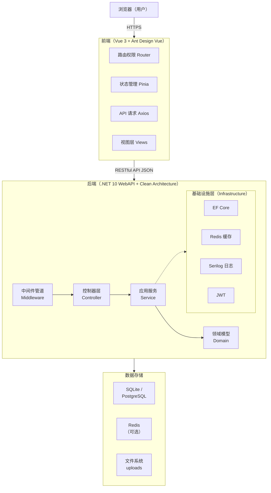
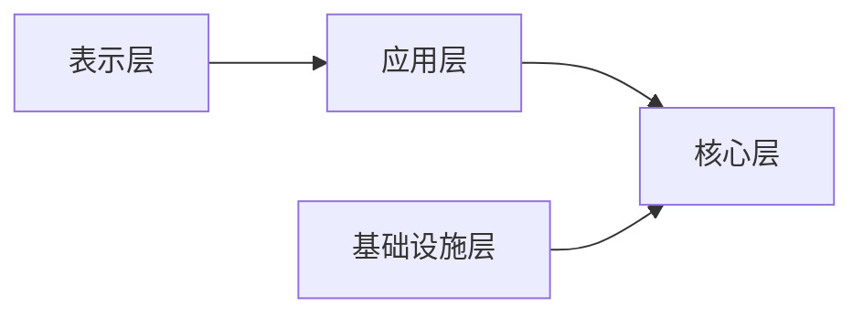
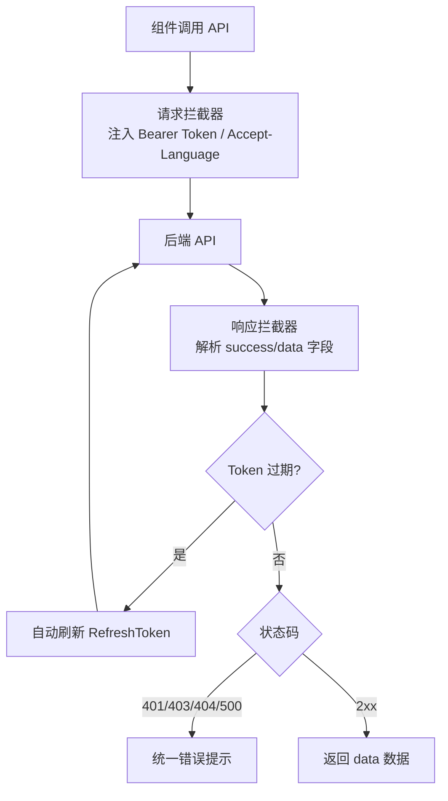

# 系统架构

## 1. 整体架构

Chet.Admin 采用前后端分离架构，前后端通过 RESTful API 通信：



## 2. 后端架构

后端位于 `Chet.Admin.Api/`，遵循 **Clean Architecture + DDD**，分为四层，**依赖方向只能向内**：

| 层 | 项目 | 职责 |
| ---- | ---- | ---- |
| 表示层 | `Chet.Admin.Api` | 控制器、中间件、DI 注册、启动配置 |
| 应用层 | `Chet.Admin.DTOs` / `Mapping` / `Services` | 业务逻辑、对象映射、DTO |
| 核心层 | `Chet.Admin.Domain` / `Contracts` / `Shared` | 领域实体、接口契约、共享类型 |
| 基础设施层 | `Chet.Admin.Data` / `Caching` / `Configuration` / `Logging` | 数据访问、缓存、配置、日志 |



> 核心层不依赖任何外层，是 Clean Architecture 的核心约束。

> 后端分层详解、解决方案结构、启动流程、设计原则等深度内容，请参考 [后端架构](/backend/01-architecture)。

## 3. 前端架构

前端位于 `Chet.Admin.Web/`，是基于 [Vben Admin v5.7](https://vben.pro) 的 pnpm Monorepo，主应用为 `apps/web-antd`（Ant Design Vue 技术栈）。

```
Chet.Admin.Web/
├── apps/                    # 应用
│   ├── web-antd/            # ★ 主应用（Ant Design Vue）
│   └── backend-mock/        # Nitro Mock 服务
├── internal/                # 内部工具包（tailwind/tsconfig/vite-config）
├── playground/              # 示例工程
└── package.json             # 根工作区配置
```

> 业务开发主要在 `apps/web-antd` 中进行。前端目录结构、API 请求层、页面开发规范、权限控制等，请参考 [前端开发指南](/guide/frontend)。

## 4. 请求流程

前端请求统一通过 `requestClient`（封装的 Axios 实例）处理：



## 5. 部署架构

系统支持多种部署方式：

- **单体部署**：所有功能部署在单一应用中，适合中小规模
- **容器化部署**：Docker / Docker Compose 一键部署（推荐）
- **前后端独立部署**：前端静态资源 + 后端 API 服务，通过反向代理（Nginx）转发

> 部署详情请参考 [部署指南](/guide/deployment)。

## 6. 默认运行端口

| 服务 | 地址 | 说明 |
| ---- | ---- | ---- |
| 后端 API | http://localhost:5000 | Swagger UI：http://localhost:5000/swagger |
| 前端（开发） | http://localhost:5666 | Vite 开发服务器，自动代理 `/api` 到后端 |
| Redis（可选） | localhost:6379 | 默认关闭，可按需启用 |

## 7. 相关文档

- [后端架构](/backend/01-architecture) — Clean Architecture 分层详解、启动流程
- [配置管理](/backend/02-configuration) — appsettings.json 配置项
- [数据库设计](/backend/03-database) — RBAC 模型与表结构
- [前端开发指南](/guide/frontend) — 前端目录与开发规范
- [快速开始](/guide/quick-start) — 本地启动前后端

## 8. 延伸阅读

「文章」栏目提供更深入的架构与原理剖析：

- [后端分层架构](/articles/04-backend-architecture) — Clean Architecture 演进与依赖反转
- [安全基石 JWT 认证](/articles/05-jwt-auth) — 双令牌机制与刷新流程
- [权限模型 RBAC 三层防护](/articles/06-rbac) — 菜单 / 按钮 / 数据权限协作
